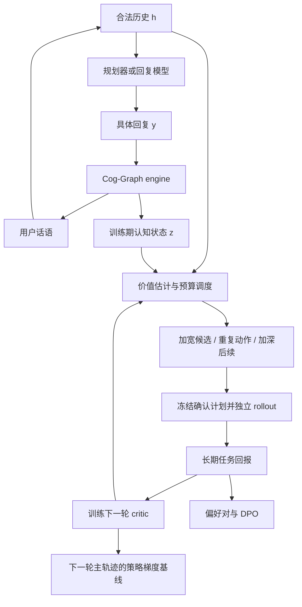

# CSRL：认知状态引导的强化学习——算法与实验设计

> Cognitive-State-Guided Reinforcement Learning（CSRL）  
> 日期：2026-09-06。本文依据当前仓库代码和 PPDPP 提出算法设计，明确区分已实现环境与拟新增训练模块。超参数为启动建议，尚未经过实验验证；本文不表示训练代码已经实现。

> 本版将主方案限定为：当前策略生成候选，认知价值估计指导预算分配，完整回报提供训练信号。可选生成与模型扩展统一置于文末。原始 [CSRL构想.md](CSRL构想.md) 保留供追溯。

## 1. 研究问题与实验组织

研究问题：**在相同训练成本下，显式用户认知状态能否改善采样预算分配和长期行为价值估计，从而提高对话策略的学习效率？**

认知状态作为训练期特权信息使用。部署时策略只读取合法公开历史及自身任务信息，不要求获取真实用户认知图。

| 路线 | 学习对象 | 优化方式 | 定位 |
|---|---|---|---|
| CSRL-Planner-RL | 根据对话历史选择策略的小模型 | 在策略采样的策略梯度＋认知价值基线 | 主实验：采样效率与信用分配 |
| CSRL-Planner-Pref | 同一策略规划器 | 离散策略的 DPO 式偏好优化 | 连接实验：控制动作空间与模型 |
| CSRL-Response-DPO | 直接生成回复的开放权重 LLM | 回复级 DPO | 泛化实验：不同学习粒度 |

三条路线共享环境接口、任务奖励、快照、预算调度与续采样服务，价值模型按各自行为策略训练，不要求共享参数。DPO 是框架内的偏好学习路径，不称为在线策略梯度算法。初期不将 DPO 和 RL 串联训练，避免混淆贡献。

PPDPP 通过小型策略规划器控制冻结回复 LLM，并用模拟交互和目标回报训练规划器，原文使用普通策略梯度而非 PPO。[PPDPP 原论文](https://arxiv.org/html/2311.00262v2)

与 PPDPP 的区别应落在“认知信息如何改善经验采集和价值估计”。只把用户模拟器替换为本仓库 engine，不足以证明 CSRL 算法贡献。



### 1.1 问题动机：为什么图值得进入训练流程

多轮主动对话的目标不是单句看起来合理，而是后续任务结果。建模示例：用户说“我再考虑一下”，可能对应事实顾虑、目标冲突或尚未形成承诺；相同表面回复并不保证相同未来。这里是问题说明，不是已获得的实验结论。

链式交互可以学习策略，但每条长轨迹的代价较高，终局结果难以指出下一笔预算应花在哪里。树结构能复用前缀、比较不同动作，已有 Tree-GRPO 等工作利用这一特性构造训练信号。[Tree-GRPO，ICLR 2026](https://arxiv.org/abs/2509.21240) 因此 CSRL 的新颖性不能仅是“用了树”。

仓库维护了显式 G/A/E。本文的假设是：这些状态包含超出公开历史的价值预测信息，能帮助选取值得继续模拟的位置，并形成更有效的学习信号。图是否有增量信息、是否抵得过状态生成和分支的额外开销，必须在等成本下检验。

### 1.2 挑战、设计与可证伪假设

| 挑战 | 方法对应 | 关键验证 |
|---|---|---|
| 内部用户状态不可直接观测 | actor 只看 h，训练期 V 读取 h＋z | h＋z 是否比 h 更准确预测后续回报 |
| 长期效果、随机反应和模拟费用混在一起 | 先导分支区分加宽、重复和加深 | 相同费用下排序／价值误差是否降低 |
| DPO 与 RL 的监督目标不同 | 偏好调度服务动作比较，RL 调度服务 V 期望估计 | 排序增益不能替代 critic 误差与梯度方差证据 |
| 模拟器可自洽却不真实 | 固定任务奖励，独立评价与跨环境测试 | 换模拟器后收益是否仍成立 |

预期论文故事是：认知状态有增量信息 → 引导更有效的经验采集 → 在相同总成本下改善学习 → 收益在独立环境中保留。任何环节未通过，都缩小结论，不通过增加模块掩盖。

### 1.3 相关工作与证据边界

| 相关工作 | 可以借鉴什么 | 本方案不能据此宣称什么 |
|---|---|---|
| [PPDPP，ICLR 2024](https://arxiv.org/html/2311.00262v2) | 规划器控制冻结回复模型，使用交互任务回报 | 更换用户环境就等于新策略算法，或原文采用 PPO |
| [Tree-GRPO，ICLR 2026](https://arxiv.org/abs/2509.21240) | 共享前缀及树结构训练信号 | 本文不同采样／更新自动继承其理论等价性 |
| [Baisero & Amato，非对称 RL](https://arxiv.org/abs/2105.11674) | 训练期隐藏信息辅助部分可观测学习；历史条件重要 | 认知图是充分 Markov 状态，或任意 critic 都降低方差 |
| [DPO，NeurIPS 2023](https://arxiv.org/abs/2305.18290) | 标准偏好损失与参考策略 | 多轮 Q 排序自动保证全局多轮最优策略 |
| [Kaufmann & Koolen，NeurIPS 2017](https://arxiv.org/abs/1706.02986) | 树搜索中的最佳动作识别和简单遗憾视角 | 其博弈树置信保证适用于本文随机用户和近似 critic |
| [Deep Ensembles，NeurIPS 2017](https://papers.nips.cc/paper_files/paper/2017/hash/9ef2ed4b7fd2c810847ffa5fa85bce38-Abstract.html) | 多模型分歧可作为经验不确定性估计 | 分歧就是置信区间或可靠的心理不确定性 |
| [Howard et al.，Annals of Statistics 2021](https://arxiv.org/abs/1810.08240) | 序贯查看和停止需要时间一致推断工具 | 对普通 bootstrap 任意停止仍有固定置信正确率 |
| [Yoon et al.，NAACL 2024](https://aclanthology.org/2024.naacl-long.83/) | LLM 用户模拟与人类行为存在可测偏差 | 图—话语一致足以证明真实用户有效性 |
| [Huang et al.，AAAI 2026](https://ojs.aaai.org/index.php/AAAI/article/view/39348) | 模拟反馈可能使对话规划器形成策略偏好偏差 | 增加 persona 就充分消除偏差，或高策略熵必然更好 |

这些来源支持设计动机和风险识别，不证明本文的预算公式最优。本轮核查不足以支撑“首次提出”或穷尽相关工作的声明。

### 1.4 主版只保留最小机制

主版只使用当前策略候选、V 集成、预算规则和既有任务奖励。暂不引入单独 Q 网络、机制分类器、额外候选生成器、图神经网络、学习式调度或心理稠密奖励。这些功能只有在主假设成立后才考虑。

主实验为 Planner-RL；Response-DPO 展示回复级适用性；Planner-Pref 是固定模型与动作空间的小型连接实验。优先比较各自相对匹配基线的增益，不用不同模型的绝对分数互相证明。

## 2. 现有模拟器：输入、建模与输出

### 2.1 代码与能力边界

| 文件 | 已实现功能 |
|---|---|
| [schema.py](../engine/schema.py) | Seed、BDI 节点、边、Appraisal、Emotion 与工具契约 |
| [prompts.py](../engine/prompts.py) | 初始化、用户转移、条件重写、agent 输入隔离 |
| [updater.py](../engine/updater.py) | 图增量落地、噪声和承诺守卫 |
| [simulator.py](../engine/simulator.py) | init、step、恢复、审计、日志；当前 SCHEMA_VERSION=3 |
| [llm.py](../engine/llm.py) | 结构化调用、模型配置与重试 |
| [agent.py](../engine/agent.py) | 普通回复调用，目前没有可训练规划器 |
| [eval_tree.py](../tools/eval_tree.py) | 深复制模拟器、共享前缀、手写话术分支 |

尚未实现：RL wrapper、任务奖励、V critic、认知调度器、训练轨迹格式、DPO 导出器、参数优化器及统一实验管理。部分 README 已落后于代码，实验必须锁定实际版本。

### 2.2 Seed 输入与信息可见性

| 字段 | 用途 | 可见性 |
|---|---|---|
| seed_id | 缓存、分组、去重 | 不作为模型捷径特征 |
| task | emotional_support / persuasion_donation / price_negotiation | 环境与策略 |
| persona | 对话前公开用户信息 | 环境与策略 |
| private_persona | 用户私有立场，如买方目标价 | 仅模拟器 |
| agent_private | agent 自身私有立场，如卖方底线 | agent 合法输入；当前谈判 renderer 使用 |
| scenario | 场景 | 合法任务上下文 |
| pre_context / u0 | 干预前缀；无前缀时用 u0 | 初始化和后续交互 |
| reference_transcript | 参考后续对话 | 禁止进入 Init、rollout、actor 或 critic 的在线输入 |
| cognitive_style | 第一人称认知更新习惯 | 仅模拟器提示词 |
| cognitive_profile | 守卫档位 | 仅引擎程序逻辑 |
| notes | 来源及任务元信息 | 白名单使用，禁止整段输入模型 |

预处理先固定干预前缀，再抽取 persona；不得从后续成交、捐赠等结果反推初始意向。公开／私有划分必须在数据构造阶段审查。

### 2.3 BDI 图 G

节点字段为 `id/type/content/strength`。B 表示信念命题，D 表示希望实现或避免的状态，I 表示具体行动承诺。content 采用用户第一人称，strength 是 `[0,4]` 直接浮点输出；不是概率分布、不确定性或熵。ID 只在会话内有效，不能将不同用户的 B1 当作同一特征。

| 关系 | 合法方向 | 机制 |
|---|---|---|
| facilitates / inhibits | B→D、D→I、B→I | 合意性评价、慎思、手段评估 |
| means_for | I→D | 意向的目的归属 |
| conflicts_with | D↔D | 欲望冲突，无向 |

引擎维护活跃与失活节点，支持节点 add/update/deactivate 和边 add/remove。非法方向被拒绝，但**不会沿边自动传播强度**；变化由 LLM 提议。因此图是结构化模拟状态与审计依据，不是真实心理因果识别的证明。

### 2.4 Appraisal 与 Emotion

定义 `z_t=(G_t,A_t,E_t)`，A 表示 Appraisal，RL 优势另用 Adv 表示。

| 状态 | 字段 |
|---|---|
| Appraisal | goal_congruence∈[-1,1]、controllability∈[0,1]、goal_conflict∈[0,1] |
| Emotion | category、valence∈[-1,1]、arousal∈[0,1]、appraisal_target |

category 为 17 类闭合集：neutral、anxiety、sadness、shame、guilt、anger、fear、loneliness、helplessness、confusion、frustration、irritation、distrust、relief、hope、warmth、surprise。appraisal_target 指向节点或话语目标。

当前初始化 A 为 `(0,0.5,0)`，E 为 neutral、valence=0、arousal=0.2、target=`#session_start`。这是实现约定，不代表用户初始真实情绪中性；困扰可能已在 persona/G0 中。需要检查该默认值对早期价值预测的影响。

### 2.5 初始化契约

\[
G_0=Init(P,S,H_0;style).
\]

输入：用户 persona（含用户私有信息）、style、场景、干预前缀；system 包含本体、初始化及任务规则。初始化依据固有态度、情境激活、前缀直接证据三层信息；无前缀证据时不预植成交／捐赠等结果意向。

`initialize_cognitive_state` 输出 nodes、edges；`build_initial_graph` 落地。`init()` 返回日志，包含 graph、strengths、deactivated、初始 A/E、llm_raw、ops_rejected、notes。

初始化使用 `ANTHROPIC_INIT_MODEL` 和 temperature=0，并缓存至 session 目录的 `g0/<seed_id>.json`。复用缓存保证同一实验起点，不能承诺外部 API 在 temperature=0 下完全确定。

拟新增缓存键：seed 内容、prompt、模型、schema 的哈希。当前按 seed_id 定位，修改种子后可能读到旧图。

### 2.6 单轮输入与执行顺序

```python
turn = sim.step(agent_reply=y_t)
```

engine 接受具体话语 y，不接受抽象策略 a；planner 必须先经过冻结回复模型生成 y。

实际 pipeline：

1. 输入 persona、style、当前图、上一轮 A/E、历史、最新 y 和上一轮拒绝／审计反馈。
2. `simulate_user_turn` 联合生成 node_updates、edge_updates、appraisal、emotion、user_utterance、done、done_reason。
3. updater 落地图操作；截断 A/E 范围，执行守卫及审计。
4. 实质性拒绝或警告触发 `rewrite_user_turn`，只重写用户话语及终局字段，不能再次修改图。
5. 提交状态与历史，记录 turn 并返回。

正常轮为一次联合结构化生成后程序落地，并非两个独立串行生成模型。重写提高状态话语一致性，但不构成语义一致性的数学保证。结构校验、API 重试、条件重写可能带来多次调用，`turn.retries` 不覆盖全部 API 尝试。

重要守卫：纯强度变化 `|Δ|<0.4` 的过滤（真实内容修订例外）、persistent 意向持久性、非法边拒绝。代码中反抗审计检查 `reactance == "pronounced"`。更新阻抗主要通过自然语言 style 实现，不能当作已实现的数值转移参数。

### 2.7 上下文与时域

模拟器读取完整前缀和最近 8 条新增话语；图提示显示活跃图及最近失活信息，并截断过长节点文本。agent renderer 使用前缀及完整新增历史。训练时记录双方截断规则。

已有 16 条新增历史话语后，提示词要求下一轮尽快结束，即 8 个完整交互之后出现收尾提示；它不是硬截断。建议训练版将此提示参数化并关闭，由 wrapper 统一 `T_max`。保留原配置作为兼容实验，环境配置改变后重新检查模拟质量，所有比较组一致。

### 2.8 输出消费

| turn 字段 | 用法 |
|---|---|
| agent_reply、user_utterance | 更新公开历史 |
| graph_after、deactivated_after | 下一图与恢复依据 |
| appraisal、emotion | 下一认知状态 |
| deltas、ops_applied | 实际状态变化特征 |
| ops_rejected、notes | 审计；不直接当作负奖励 |
| done、done_reason | 终止提示；不等于任务成功 |
| llm_raw、retry_raw | 调试，不进入训练模型输入 |
| turn_index、mode、system_prompt_used | 复现与追踪 |

新增、失活、内容改写与边变化无法只靠 deltas 完整描述，需结合前后图和 ops_applied。前动作 critic 输入禁止使用当前动作之后的 graph_after、终局结果或评价。

## 3. 形式化与模型接口

完整可分支状态：

\[
x_t=(Seed,G_t,A_t,E_t,history_t,feedback_t,terminal_t,config).
\]

h 是合法公开历史及 agent 自身信息，z 是结构化认知部分；不假定 z 是充分 Markov 状态。

\[
(x_{t+1},u_{t+1})\sim\mathcal E(\cdot\mid x_t,y_t),\qquad
J(\theta)=\mathbb E\sum_{t=0}^{T-1}\gamma^t r_t.
\]

| 模块 | 输入 | 输出 |
|---|---|---|
| planner actor | h | π(a∣h) |
| 冻结回复模型 | h、策略描述 a | y |
| 回复 actor | h | π(y∣h) |
| 认知 V | h、z | 期望回报及集成分歧 |
| 候选价值估计 | 实际分支回报＋前沿 V | 候选价值与调度分数；主版不训练独立 Q 网络 |
| 采样器 | 完整快照、预测、预算 | 分支任务与选择概率 |
| reward adapter | 对话、任务目标、合法评价元信息 | reward、结构化结果 |

主 critic 不额外读取 private_persona/style/profile；可另设完整特权信息消融。如此能区分认知图与人格元数据的贡献。私有信息不进入 actor，也不进入 DPO prompt。

认知编码起点：序列化节点 type/content/strength÷4/active、局部 ID 与边、A/E，接文本编码器和回归头。固定 token 上限，记录截断率。比较完整图、无边节点集合、A/E、等 token 心理摘要后，再决定是否引入 GNN。

建议 3 个独立初始化或案例级 bootstrap 的价值模型组成集成。标准差仅为经验不确定性指标，须与留出 rollout 误差校准；不等于统计置信区间。

### 3.1 行为策略、估计对象与最小价值模型

μ_k 表示第 k 轮实际续采样规则，包含动作抽样、回复模型和文本解码配置；π_k 表示可训练策略。planner 主轨迹动作按 π_k 的合法分布抽样，温度 1、无 top-k 裁剪，保证记录的动作 log probability 与梯度一致。回复 DPO 的 μ_k 包含固定 temperature/top-p，长期标签估计 Q^{μ_k}，不能无说明写成未经解码处理的 π_k 价值。

V(h,z) 是对完整环境条件价值的近似，z 未必包含 persona/style 等全部转移信息；这类表示误差需由留出回报检验。固定 x、替换动作属于模拟器内对照，不等于真实用户因果识别。

主版只训练 M=3 个 V 成员。候选价值由实际分支和前沿 V 估计，避免再引入 Q 网络及其冷启动标签依赖。成员按原始案例 bootstrap、独立初始化；只共享骨干换线性头是较便宜近似，需要单列。图编码、token 截断和公开历史对照保持一致。

## 4. 任务奖励与终止

主实验保持奖励不变，让认知状态改善估计，而非直接改变目标：

\[
r_t=\begin{cases}-c,&交互继续,\\R_{task}(\tau),&任务终局或达到时限.\end{cases}
\]

建议 γ=0.99、c=0.02，终局奖励归一化至 `[0,1]`，终局轮不重复扣 c。这是同条件 CSRL 配置，非 PPDPP 原始超参数。

| 任务 | 建议终局目标 | 额外评价 |
|---|---|---|
| 谈判，当前 agent 为 seller | 有效成交且满足卖方硬底线：0.5＋0.5×卖方归一化效用；否则 0 | 成交率、价格、包含未成交的期望效用、约束违反率 |
| 情感支持 | 独立 rubric：无改善／恶化 0、部分改善 0.5、显著改善 1 | 盲评支持效果、理解程度、质量 |
| 捐赠 | 对话中明确承诺捐赠为 1，否则 0 | 承诺率、明确金额、质量 |

谈判效用可取 `clip((price-seller_floor)/(listed_price-seller_floor),0,1)`；仅在元信息可靠且分母为正时使用，否则事先规定成交率目标并分开报告，禁止临时猜底价。对照需统一买卖角色。对话捐赠承诺不是实际支付，支持评分不是临床效果。

reward adapter 拟输出：

```json
{
  "terminated": false,
  "truncated": false,
  "outcome": "ongoing",
  "reward": -0.02,
  "task_score": null,
  "valid_transition": true,
  "termination_source": null,
  "evaluator_version": "task-rubric-v1"
}
```

- terminated：成功、拒绝、破裂等任务终止；truncated：达到统一上限。
- API/schema 失败有限重试后记为无效转移，不伪造用户拒绝或成功；费用仍计入，报告失败率及排除偏差。
- done 分支不再 step，不复制成多个独立叶子。
- engine done 但 evaluator 不认可成功时，记录非成功终局和冲突，不为提高分数继续对话。
- evaluator 固定 rubric、模型与解码设置，验证集校准后冻结。训练评估结果不依靠 BDI 自评。

### 4.1 评价器的可执行约束

谈判输出必须区分明确双方同意、单方报价、条件未满足的接受和明确离场。只有当前成交对象与最终价格一致、双方确认、满足 agent 硬约束时奖励有效；引用历史价格不能当新成交价。奖励适配器保存 evidence_spans 和数值提取结果，仅供审核，不给 actor。

情感支持采用冻结的对话级 rubric：0 表示没有可观察改善或明显恶化；0.5 表示出现被理解、重新评价或可行动性等部分改善证据，但主要困扰仍未缓解；1 表示存在明确、连贯的缓解或恢复应对能力证据。单独“谢谢”、更强的缓解愿望、礼貌收尾不能直接判 1。评价允许 uncertain，固定三次独立判断，输出类别分布和分数均值；uncertain 的处理在人工校准后冻结，不临时转换成成功。三次采样并不消除同模型系统偏差。

程序对 engine.done 或 T_max 结束的对话调用终局评分；继续交互只给轮成本，不为了寻找成功每轮增加未计费 judge。评价器要求提前终止与 engine 终止不一致时先固定统一协议，再训练。训练 judge 和外部测试 judge 分离；人工校准在验证集独立抽样完成。

## 5. 共享 rollout：同一基础设施，不同估计目标

### 5.1 快照、候选与树范围

原型使用 deepcopy(sim)，分支关闭 session_file，统一记录费用。fork/restore 必须保留完整 x，恢复后下一步 prompt、反馈和图一致。不能只复制 G，不能按图相似合并不同历史，也不能假定外部 API 随机种子可恢复。

本版是“主轨迹节点上的分支子树”，不是递归寻找最优动作的完整 MCTS。候选只在主轨迹节点展开；分支内部按冻结 μ_k 继续。延长一条路径不会产生新的独立首轮用户反应。

候选仅从当前策略在合法 h 上抽取，K_initial=4、K_max=6；planner 保存不同策略 a，回复路线保存不同 y。最多 3×K_max 次生成尝试，做规范化字符串去重；不足则使用实际候选数。语义多样性只作诊断，不依赖另一个机制分类器，也不保证覆盖全部机制。生成／去重失败均计成本。

planner 确认某个 a 时重新由固定 f(h,a) 生成 y；回复路线确认固定 y。所有后续使用同一 μ_k。已有对话策略标签可记录，但不用于按 z 强制生成候选。

候选筛选本身有费用：偏好路线每轮先从主节点均匀选最多 8 个父节点（每案例最多 1 个）建立初始池，在可预留费用范围内完成候选首轮，随后才对这些节点使用 S_pref。其余主节点的加入通过预定均匀配额进行，不免费假定已经获得所有节点的候选分数。RL 可直接用已有前动作 V 分歧初始化 S_V，再逐步获得先导统计。批量父节点上限在所有比较组一致。

### 5.2 从先导路径计算候选分数

对候选 i 的独立首动作重复 ℓ，其前沿深度为 d_ℓ，集成成员 m 预测：

\[
v_{i\ell m}=\sum_{j=0}^{d_\ell-1}\gamma^j r_{t+j}
+\gamma^{d_\ell}V_{km}(h_{t+d_\ell},z_{t+d_\ell}).
\]

真实终止或固定 T_max 时 bootstrap=0，并使用任务终局奖励；计算预算截断不是任务终止。每个重复只保留最新前沿估值，不能把旧浅层与新深层估值当两条独立样本。

\[
\mu_i=\frac1{n_iM}\sum_{\ell,m}v_{i\ell m},\quad
e_i^2=\operatorname{Var}_m\left(\frac1{n_i}\sum_\ell v_{i\ell m}\right),
\]
\[
w_i^2=\operatorname{Var}_\ell\left(\frac1M\sum_m v_{i\ell m}\right),\quad
s_i^2=e_i^2+\frac{\max(w_i^2,w_0^2)}{n_i}.
\]

n_i=1 时使用独立验证集估计的方差底限 w_0²。w_0 按任务冻结，API 重试不增加 n_i。这些分数同时受环境波动、模型误差和不同深度 bootstrap 偏差影响，并非精确不确定性分解或置信区间。独立完整确认才提供主训练标签。[集成参考](https://papers.nips.cc/paper_files/paper/2017/hash/9ef2ed4b7fd2c810847ffa5fa85bce38-Abstract.html)

### 5.3 DPO：动作排序优先级与三种操作

\[
u_{ij}=\sqrt{s_i^2+s_j^2+\epsilon},\quad
S_{\mathrm{pref}}(n)=
\frac{\max_{i<j}\{u_{ij}\exp(-|\mu_i-\mu_j|/(u_{ij}+\epsilon))\}}
{\widehat C(n)+\epsilon}.
\]

该启发式关注可能改变排序的比较，不保证找到全局最优回复，也不继承最佳动作识别文献的置信保证。[相关视角](https://arxiv.org/abs/1706.02986)

| 操作 | 执行 | 用途 |
|---|---|---|
| WIDEN | 同父状态从当前策略新增候选，执行首轮 | 候选数量／行动覆盖不足 |
| REPEAT | 从原始父 x 重新执行固定 b | 增加独立首轮结果，判断波动 |
| DEEPEN | 从已有非终止前沿按 μ_k 续 1 轮 | 降低短视野对延迟效果的依赖 |

规则起点：先补初始候选并各执行首轮；之后以 20% 概率均匀选择可用操作，其余选当前最难区分的候选对。该对某动作 n_i<2 时 REPEAT；否则若 e_i²≥max(w_i²,w_0²)/n_i、且存在可加深路径，则 DEEPEN；否则 REPEAT。初始配额后的 WIDEN 由均匀探索份额触发，受 K_max 和生成尝试上限约束。

候选对双方轮流处理，避免只加深当前赢家；深度相同时按固定顺序取前沿。先导每次加深 1 轮，d_max=3，n_min=2。此规则是待验证设计，不声称低样本下可精确区分噪声来源。history-only 与认知组使用相同规则，只替换 V 输入。

### 5.4 Planner-RL：价值误差优先级，不追逐难排序动作

actor 基线需要 V 的策略期望。动作回报全部相近不代表 V 容易估计，动作容易排序也不代表 V 已准确。因此 RL 不能直接复用 S_pref 作为全部分支优先级。

在父状态 n，从首动作起按 μ_k 抽取独立价值路径，按第 5.2 节计算父 V 的模型分歧 e_V²、经验波动 w_V² 和重复数 n_V；尚无先导时用 V 集成与方差底限。

\[
S_V(n)=
\frac{e_V^2(n)+\max(w_V^2(n),w_0^2)/\max(1,n_V)}
{\widehat C_V(n)+\epsilon}.
\]

REPEAT 每次重新采 a、y、用户；DEEPEN 续采既有价值路径。相同 a 被再次抽到是有效期望样本，不为去重改其概率。主 RL 不强制 WIDEN 不同策略，因此三操作接口共享，但其实际使用的操作集不同。

RL 操作规则起点：n_V<2 时 REPEAT；之后以 20% 概率均匀选可用操作，其余在 e_V²≥max(w_V²,w_0²)/n_V 且有未到深度上限的路径时 DEEPEN，否则 REPEAT。待延伸路径轮流选择；每节点达到事先规定的先导调用配额即退出。该规则同样是误差代理启发式。

S_V 是误差代理，不是已证明的信息增益。节点池来自均匀主轨迹，每案例配额相同，不按分支叶子数伪造状态访问频率。校准在均匀留出节点上完成。

### 5.5 选择概率、确认和成本

\[
q(n)=\eta/|\mathcal N|+(1-\eta)\operatorname{softmax}(S(n)/\tau_s),
\quad\eta=0.2.
\]

两条路线分别使用 S_pref 与 S_V。τ_s 和费用尺度按独立验证数据冻结；成本预测只用已发生调用与剩余时域。V 尚未可用时均匀 warm-up，不按未校准分数剪枝。

预算 B 包括 G0、主轨迹、先导、确认、评价和重试。50%/30%/20% 仅为启动比例；优先预留能完成的确认费用，不在大量先导后才发现无法确认。无分支基线可将省下费用用于更多主轨迹。

先导结束后：
- 偏好路线：每父节点最多锁定 1 对、预期方向与每动作固定确认次数。
- RL 路线：锁定 V 父节点及每节点次数，第一步动作仍按 μ_k 抽取。
- 所有确认重新从父快照开始跑到真实终局或固定 T_max；不边看确认结果边追加次数。
- 先导只调度；主训练标签来自完整主轨迹与独立确认。是否复用先导监督另作消融。

序贯推断文献提供了任意时刻有效的专用置信工具；普通集成和 bootstrap 没有这种保证。[Howard et al.](https://arxiv.org/abs/1810.08240) 本版固定确认次数，但仍承认样本筛选、API 漂移和相关性限制。

启动确认前按剩余 T_max、输出上限、评价和重试上限预留费用；不能保证完成就减少对象。费用截断标为 budget_censored，不进入主完整回报标签；实际费用低于预留时回收余额。

### 5.6 停止、质量和权重

ΔG=0、短期负面情绪、话语未暴露信念均不是单独剪枝条件。记录停止原因：排序明显、低信息、候选／深度上限、费用耗尽、终局或环境错误。低信息不赋负奖励；RL 主轨迹不因动作差异小而被剔除。

共享前缀存一次，actor 不按叶子数重复梯度。独立重复属于同案例嵌套样本，统计按原始案例聚类。独立确认不能消除选择哪些用户状态的偏差，保留均匀探索与案例配额。

独立复核按任务、阶段、变化量分层抽样，起点 10%，模型与人工 rubric 待接入。复核分“话语支持／明确矛盾／无法验证”；未说出内部状态不等于矛盾。主版用于质量报告，若过滤则独立消融并报告各组剔除率和全部成本。

## 6. CSRL-Planner-RL 完整算法

### 6.1 策略表与初始化

planner 采用文本编码器＋分类头，先在合法训练集策略标注上 SFT；冻结回复 LLM 根据 h 和策略描述生成 y。

谈判可采用 PPDPP 的 11 类起点：Greetings、Ask a question、Answer a question、Propose the first price、Propose a counter price、Use comparatives、Confirm information、Affirm confirmation、Deny confirmation、Agree with the proposal、Disagree with a proposal。按当前卖方角色适配描述，数值报价由回复模型生成。

情感支持采用 ESConv 原始 8 类映射：Question、Self-disclosure、Affirmation and Reassurance、Providing Suggestions、Reflection of feelings、Information、Restatement or Paraphrasing、Others；接入时核验原始标签字符串。捐赠没有可靠策略标签时，先做 Response-DPO 扩展，再固定 planner 标签协议。

合法动作 mask 只能根据公开历史和 agent 自身约束构造，训练、采样和部署一致，不得利用私有图替 actor 排除动作。

### 6.2 主轨迹更新 actor，分支训练 critic

第一版采用统计上清楚的保守设计：分支不直接进入 actor loss，而是补充 V 监督。

\[
G_t=\sum_{j=t}^{T-1}\gamma^{j-t}r_j,\quad
Adv_t=G_t-stopgrad(V_{\phi_k}(h_t,z_t)).
\]

\[
\mathcal L_{actor}=-\frac1N\sum_{i=1}^N\sum_t\gamma^t
\log\pi_\theta(a_{it}\mid h_{it})Adv_{it}.
\]

对应第 3 节折扣目标，按案例平均轨迹和。每个 on-policy batch 起点为一次更新；多 epoch PPO 是后续共同优化器消融，不能只给 CSRL 更换。

本轮 actor 使用采样前已冻结的上一轮 critic，防止在当前轨迹上拟合后回填基线。它可能滞后一轮策略，预测和降方差效果需实测；作为动作无关基线不要求数值精确。主版不按当前 batch 标准差缩放优势。训练期隐藏状态 baseline 与部分可观测策略有关，但不能声称任何认知 critic 都降低方差。[非对称强化学习](https://arxiv.org/abs/2105.11674)

前动作基线的依据：固定 h,z 时 actor 按 π(a|h) 抽样，所以 E_a[∇logπ(a|h)b(h,z)]=b(h,z)∇Σ_aπ(a|h)=0。这只说明条件成立时 baseline 项不改变期望梯度；不证明任意 V 降低方差，也不修复选择性丢弃环境失败产生的偏差。

独立 V 确认从首动作起按 μ_k 续采样；固定候选动作回报不得作为父 V 标签。主版不训练独立 Q，也不对未覆盖动作错误归一化。

V 用完整回报 MSE，按原始案例均衡采样。第一版只用最近一轮主轨迹和 V 确认，保存 policy_version；两来源各占训练 batch 的 50%，某来源为空时明确回退。最多 3 epoch、均匀留出集早停。先导不进主 loss。actor 更新后再训练下一版 V，并保存主节点 KL 以监控策略漂移。

完整回报只在未被费用截断的轨迹上使用；错误排除率和可能偏差必须报告。分支主要改善下一轮 baseline，因此是否值得额外调用必须由等费用实验判断。

### 6.3 伪代码

```text
输入：训练 Seed、SFT planner、冻结回复模型、engine、reward、总预算
均匀 warm-up：收集完整回报并训练 V 集成，费用计入
for iteration k:
    冻结 π_k、实际 μ_k、V_k、环境及评价配置
    D_main = 从预先均匀抽取的案例采主轨迹，保存完整 x
    在主节点池按 S_V/q 选择父状态
    在预算内 REPEAT（首动作也抽样）或 DEEPEN
    固定 V 确认对象与次数，预留完整费用
    D_value = 从父 x 按 μ_k 独立完整续采样
    用 D_main 的 G - V_k 更新 actor 一次
    用 D_main/D_value 完整标签训练下一版 V
    记录费用、失败、策略 KL、均匀留出误差和验证表现
输出：只依赖合法 h 的 planner，部署不加载 engine 或 critic
```

该版本分支收益主要经 critic 体现，必须由等成本实验检验是否划算。后续若把树 Q 直接用于 actor 更新，需重新处理父状态选择、动作概率、共享前缀及自适应停止偏差；PPO 概率比不会自动校正全部搜索偏差。

## 7. CSRL-Response-DPO 完整算法

### 7.1 长期偏好构造

1. 同一 SFT 回复模型初始化 π_0，并固定 π_ref。
2. 冻结 π_k 及其实际 μ_k 解码规则，按 μ_k 采样主轨迹。
3. 同一 x、同一 h 下采样 K 个候选回复 y。
4. 先浅层试探，按 S_pref 加宽／重复／加深；先导结束每父节点最多锁定 1 对及预期方向，预留确认费用。
5. 固定次数独立确认，候选之后均使用实际 μ_k；不查看结果后追加确认。
6. 只有确认仍支持预先选定方向的候选对才构造成 `(h,y+,y-)`。
7. 标准 DPO 更新；下一轮刷新行为策略及数据。

每次确认从父快照重新执行 y，重采首个用户反应。K_initial=4、K_max=6，先导 n_min=2；主版确认每动作 8 次，4 次仅作低成本消融。

先导锁对时平均差≥δ；确认同方向、均值差≥δ 且 bootstrap 方向稳定率达到阈值才导出。起点 δ=0.05、稳定率 0.8、bootstrap 1000 次，均在独立验证点校准。8 次仍不足以产生强置信保证；这是过滤规则，需用独立高重复参考报告误标率。每父节点最多 1 对，确认方向相反时丢弃，不翻转或重新挑别的最佳对。仍存在保留样本后的筛选偏差，故不按确认差值大小加训练权重。

DPO 路线下一版 V 主版仅用其完整主轨迹训练；固定首回复确认是 Q 统计，不作父 V 标签。后动作状态的 μ_k 后缀可用于 V 是后续数据利用扩展。回复行为的解码配置与标签版本共同保存。

### 7.2 优化目标与输入隔离

\[
\mathcal L_{DPO}=-E\log\sigma\left(\beta\left[
\log\frac{\pi_\theta(y^+|h)}{\pi_{ref}(y^+|h)}-
\log\frac{\pi_\theta(y^-|h)}{\pi_{ref}(y^-|h)}\right]\right).
\]

仅计算当前 assistant 回复 token 的序列 log probability，mask 掉 prompt；后续双方轨迹用于标签，不拼成 completion。第一版不额外按认知变化量加训练权重，不悄悄改成长度平均损失。[DPO 原论文](https://arxiv.org/abs/2305.18290)

隐藏状态影响样本选择，可能过度代表某类用户；即使 actor 看不到 z，也存在覆盖偏差。采用均匀探索、案例配额和风格分层评价。同一 h 在不同隐藏用户状态下有不同偏好属于部分可观测性，不应靠删矛盾数据掩盖。

该多轮 Q 偏好学习是设计扩展，不自动继承原 DPO 的全局多轮最优性结论。

拟新增导出格式：

```json
{
  "case_id": "train_case_001",
  "parent_id": "tree_001_node_003",
  "prompt_messages": [{"role": "user", "content": "public context only"}],
  "chosen": "assistant reply A",
  "rejected": "assistant reply B",
  "metadata": {
    "policy_version": "iteration_2",
    "reference_version": "sft_v1",
    "q_chosen": 0.7,
    "q_rejected": 0.3,
    "confirmation_runs_per_action": 8,
    "parent_selection_probability": 0.02,
    "candidate_source": "current_policy",
    "pair_selected_before_confirmation": true,
    "schedule_log_id": "schedule_001",
    "budget_censored": false,
    "snapshot_id": "private_snapshot_123",
    "evaluator_version": "task-rubric-v1"
  }
}
```

数值仅为示例。metadata 不输入模型，私有快照独立存储；loader 明确白名单。

## 8. 连接实验：Planner-Pref

保持 Planner-RL 的骨干、SFT 权重、策略表、冻结回复模型、数据和奖励，将 DPO 损失的回复 y 替换为策略 a。每条策略重复生成具体回复和用户反应后评估长期价值。

与 Planner-RL 比较控制了动作空间与模型；与 Response-DPO 比较共享偏好学习机制。连接实验优先只在一个主任务、匹配费用档位完成 D3/D4/D5；它不是第三套同规模主实验。比较各自相对匹配基线的增益。

## 9. 实验设置

### 9.1 数据划分与规模

本次核查 `seeds/` 有 16 个 JSON：谈判 5、情感支持 6、捐赠 5，仅适合流程先导，不足以正式训练和测试。

正式实验优先 [ESConv](https://aclanthology.org/2021.acl-long.269/) 和 [CraigslistBargain](https://aclanthology.org/D18-1256/)，捐赠第三阶段扩展。沿用有依据的公开划分；采用 PPDPP 派生划分时记录案例清单和版本，不凭相同比例宣称复现。

- 同一原始对话／用户／商品案例及其 persona/style 变体归入同一 split。
- SFT、critic、偏好、采样器只用训练集；超参数用验证集；测试冻结。
- 禁止参考后续对话进入初始化；notes 逐字段筛选。
- 当前人工挑选种子不能作为调参后的独立测试。
- 合成风格改写单独标识，不当作真实人口分布。
- 先导建议每任务训练 100、验证 30 个案例；正式采用可用合法划分并锁定实际数量。测试尽量至少 100 个独立案例，样本不足时报告不确定性。

### 9.2 公共配置起点

| 参数 | 建议设置 | 约束 |
|---|---|---|
| planner | RoBERTa-base 级编码器＋分类头 | 全部 planner 组同初始权重 |
| 回复 actor | 可训练 7B–8B 级 instruct 模型＋LoRA | 资源评估后固定具体 checkpoint |
| planner 回复模型 | 同一冻结模型 | 统一策略 prompt 和解码 |
| 环境／Init | 固定实际 ANTHROPIC_MODEL / ANTHROPIC_INIT_MODEL | 与 actor 分离配置，记录实际解析 ID |
| critic | 3 个 V 成员，不设独立 Q | 对照容量、训练步数匹配 |
| T_max | 10 个新增完整交互 | 统一或关闭现有收尾提示 |
| γ、c | 0.99、0.02 | 全部同条件训练组一致 |
| 回复候选 | K_initial=4，K_max=6，最多 18 次生成尝试 | 全部 current_policy；不足用实际数量 |
| 解码 | 回复 temperature=0.8、top-p=0.95；planner 动作温度=1 | 实际 μ_k 单独记录 |
| 独立确认 | 每对象 8 次 | DPO 每动作；RL 每父状态，不固定首动作 |
| 先导调度 | 初深度 1、最小重复 2、每次加深 1、深度上限 3 | 上限不是终局；确认跑完整剩余时域 |
| 费用预留 | 主轨迹／先导／确认 50%／30%／20% | 预留不足时减少对象，不伪造完整回报 |
| 用户转移 | 支持时显式 temperature=0.7 | 当前未显式设置；参数化后检验环境质量 |
| 回复长度 | 最大 256 新 token | 全部回复组一致 |
| planner／critic LR | 1e-5／2e-5 | 同验证搜索空间 |
| LoRA／DPO | rank=16、LR=5e-6、β=0.1 | 起点，固定参考模型 |
| DPO 更新 | 每轮新数据 1 epoch 起步 | 另计训练 token 预算 |
| 主 batch | 16 条完整主轨迹 | 叶子不当独立案例 |
| 随机种子 | 至少 3，主结论建议 5 次训练 | 外部 API 随机性独立说明 |

运行前还须固定具体 checkpoint、策略映射、软件版本、数据 manifest、总预算和验证调参次数。以上参数不代表当前硬件可运行或已得到最优设置。

先用 10 个训练案例做费用校准，估计剩余时域的完整 rollout 成本；不查看测试表现。随后冻结 B0，以 B0/2、B0、2B0 三档比较。金额、硬件、模型 checkpoint、完整数据 manifest 和奖励 rubric 人工校准尚未确定，运行前必须补齐，不能声称本文已给出可直接复现实验配置。

无分支组可将节省费用用于更多主轨迹，不能固定相同主轨迹数却让分支方法额外花钱。分别报告交互费用、GPU 小时和总费用；调参试验次数及验证预算相同。

### 9.3 Planner-RL 主实验组

| 组 | 环境 | 采样 | 学习信号 | 目的 |
|---|---|---|---|---|
| P0 | 普通 LLM 用户模拟器 | 链 | PPDPP 式回报 PG | 外部方法基线 |
| P1 | engine | 链 | 同 P0 | 环境替换收益 |
| P2 | engine | 链 | history-only critic | critic 本身收益 |
| P3 | engine | 链 | h＋z critic | 无树认知增益 |
| P4 | engine | 均匀树 | history-only critic | 普通树基线 |
| P5 | engine | 均匀树 | h＋z critic | 认知估计收益 |
| P6 | engine | history-only S_V 自适应价值分支 | history-only critic | 一般自适应收益 |
| P7 | engine | 认知 S_V 自适应价值分支 | history-only actor baseline | 单独认知采样收益 |
| P8 | engine | 认知 S_V 自适应价值分支 | h＋z critic | 完整 CSRL |

P7 单独训练认知调度 V 与 history-only actor baseline，额外费用计入；主版 P8 共用认知 V。P4/P5/P7/P8 构成采样×信用分配核心消融，P6 排除一般自适应的解释。actor 优化算法统一，不只给 CSRL 更强优化器。

### 9.4 偏好实验组

| 组 | 数据构造 | 目的 |
|---|---|---|
| D0 | SFT，不做偏好优化 | 起点 |
| D1 | 同前缀候选，独立单轮 judge 排序 | 常规偏好基线 |
| D2 | 独立链续采样，以长期回报排序 | 长期监督基线 |
| D3 | 均匀共享前缀树＋确认回报 | 普通树收益 |
| D4 | history-only 自适应树＋确认回报 | 一般自适应收益 |
| D5 | 认知自适应树＋确认回报 | 完整 Response-DPO |

D3/D4/D5 分别采用均匀、history-only S_pref、认知 S_pref；固定初始模型、参考模型、训练器和候选配置。分别报告固定总采集成本、固定训练偏好对数量的结果：前者测效率，后者测标签质量，不能混称等预算。Planner-Pref 至少做 D3/D4/D5 对应的策略版本。

### 9.5 认知与机制消融

1. h；h＋A/E；h＋无边 BDI；h＋完整 G/A/E。
2. 等证据、近似等 token 的心理摘要；生成成本计入。
3. 删除边、打乱强度、延迟 z 一轮：只改训练模块输入，不改模拟器转移。
4. 若另做模拟器去图，明确区别于训练器看不到图。
5. 偏好路线禁用 WIDEN/REPEAT/DEEPEN；RL 仅消融其实际使用的 REPEAT/DEEPEN。各组释放预算按固定配额重新分配。
6. 无独立确认／有确认；完整续采样／短视野 bootstrap。
7. 固定当前策略候选池比较调度，主版不增加候选生成来源；仅父节点选择与完整路线对应操作规则分开比较。
8. 独立复核只诊断／过滤明确矛盾；报告无法验证比例与过滤偏差。
9. 校准费用分配：认知输入、额外输入 token 和额外模型成本需分开报告；不在本轮主消融改变奖励。

先做固定数据价值预测：独立高重复 rollout 提供参考回报，报告 MAE/RMSE、动作排序准确率、不确定性校准和单位费用误差。如果 z 不提供增量预测信息，应先检查状态和编码，不能仅靠增加复杂搜索声称有效。

### 9.5.1 训练前的两类预算调度先导实验

每任务选择 30–50 个独立分支点，覆盖早／中／晚阶段、neutral、目标冲突与不同认知风格；每点固定 5–6 个候选。调度阈值验证点与最终机制测试点按原始案例隔离。这是小样本先导，不替代正式训练和泛化测试。

先比较固定候选子集（仅重复／加深），保证评价目标一致；再用完整固定候选池、相同初始 4 个候选比较带加宽的调度。在线从当前策略追加候选另作开放池诊断，不能改变固定池参考排序。

偏好估计任务中，在相同冻结后续行为 μ_k 下，为每个候选另收集例如 20 次完整参考 rollout，报告参考均值区间；接近候选承认排序不确定，不将参考均值称为真值。参考数据不进入调度器、critic 或训练标签，其费用作为单独评价开销报告，不能让某组免费读取。训练数据来源独立。

| 调度组 | 节点／操作选择 | 验证问题 |
|---|---|---|
| S0 | 均匀节点＋固定操作配额 | 基本预算基线 |
| S1 | 即时认知变化大小＋固定配额 | 变化幅度是否足够 |
| S2 | history-only 价值＋同路线操作规则 | 一般价值调度收益 |
| S3 | 认知价值选父节点＋固定配额 | 仅节点选择收益 |
| S4 | 认知价值＋路线对应操作规则 | 完整 CSRL 调度；RL 不强制加宽动作 |

另设 V 估计任务：每父状态从首动作起按 μ_k 独立采至少 20 次完整参考，不固定候选或做动作去重。比较均匀、history-only S_V 与认知 S_V 的均匀留出 RMSE/MAE；动作排序提升不能代替期望估计提升。

偏好任务比较相同累计费用下的动作排序准确率、价值 RMSE、推荐动作相对参考最优的 simple regret、偏好误标率及可靠对数。排序指标对参考近似平局单独统计；simple regret 也报告参考估计不确定性。另报告三操作次数／费用比例、覆盖率、平均深度、重复数和各停止原因。

通过标准：在多个费用档位上，相对 S0 和 S2 有可重复增益，且不限于人为明显好坏探针；预先规定主要指标和验证阈值。未通过时先诊断认知表示、校准和规则，不把增加完整 RL 训练作为跳过机制验证的办法。

### 9.6 指标、成本与统计

**任务表现：** 成功率、终局任务分、谈判期望效用、成功率随轮次曲线。平均轮数分别报告全部案例和成功案例，防止快速失败显得高效。

**采样效率：** 固定累计费用下的任务表现、学习曲线面积、达到预设目标的成本；未达到报告未达到，不外推。

**完整成本：** G0、主轨迹、候选、确认、回复生成、用户模拟、重写、校验/API 重试、评价器、摘要的输入／输出／缓存 token 与调用次数；另报 GPU 训练时长、训练 token、墙钟时间。不同模型 token 不视为等价价格，按冻结计价表另报费用。

**学习机制：** critic 留出误差、排序稳定性、每千 token 的可靠偏好对、长度与胜率分布、同策略独立数据上的梯度方差诊断。

**环境质量：** schema 失败、拒绝、重写、终止冲突、非法成交、状态话语不一致。审计通过不能替代独立人工检查。

**统计：** 原始案例级聚类 bootstrap，跨训练种子均值和区间。共享前缀叶子、同案例变体和重复用户响应不是独立用户。验证调参次数公平，测试只在预设检查点运行。

### 9.7 独立泛化

至少评价同 engine 未见案例、不同模型／提示词的用户模拟器和独立盲评；条件允许补充人工交互。judge 不读训练图，仅看合法任务信息和实际对话。

judge 不读取模型身份或方法名，顺序随机并交换检查；人工审核抽样及 rubric 冻结。记录策略分布及条件适配性：集中可能合理，也可能来自模拟偏差，不能把高熵直接当好。[对话规划偏差研究](https://ojs.aaai.org/index.php/AAAI/article/view/39348)

对未见风格、高阻抗、目标冲突用户分层报告。若提升只在训练 engine 内成立，结论限定为模拟环境内效率，不宣称真实用户收益。

## 10. 实施与训练前修复

### 10.1 本轮算法审查结论

| 问题 | 本版修正 | 仍需验证 |
|---|---|---|
| 候选来源和调度混杂 | current_policy 是唯一主训练候选来源 | 模型自身候选多样性 |
| 排序目标被直接用于 V 采样 | 分离 S_pref 与 S_V | 各自相对均匀采样收益 |
| V/Q 同时引入且标签条件混淆 | 只训练 V，候选值来自实际 rollout | 浅层近似偏差 |
| 机制覆盖没有可用分类器 | 去掉主版机制分类依赖 | 语义重复率只诊断 |
| 冻结 critic 又期待先导改变分数 | 显式计算最新前沿的 μ/e/w/s | 不同深度和小样本校准 |
| 小样本确认后重新挑最佳对 | 先锁对和方向，固定 8 次确认 | 筛选偏差及实际误标率 |
| 上一轮标签误称当前策略真值 | 明确滞后基线、policy_version 与 KL | 方差降低不是必然 |
| 图自洽被当真实用户验证 | 外部模拟器与盲评 | 真实用户效应仍需独立证据 |

### 10.2 当前代码风险

| 问题 | 代码依据 | 待处理 |
|---|---|---|
| 调用失败可能被算成交 | eval_tree 异常设置 done；classify_outcome 对非特定拒绝文本默认 deal | 用结构化 outcome 区分错误与任务结果 |
| 重写后 done_reason 可能旧值 | simulator 在重写前存局部 reason，最终 turn 仍引用它 | 写最终 out.done_reason 并检查一致性 |
| 守卫用重写前 done | apply_updates 先执行，重写可能翻转 done | 定义终局修正语义并检查翻转场景 |
| 阈值文案不一致 | updater=0.4，SYSTEM_CORE 部分写 0.5 | 统一并记录版本 |
| 缓存缺版本 | G0 按 seed_id 读取 | 增加输入／prompt／模型哈希 |
| step 无硬终止拒绝 | 调用者可继续已结束会话 | wrapper 阻止，测试 |
| 上下文收尾影响时域 | 16 条历史后要求结束 | 参数化，与 T_max 统一 |
| 成本信息不足 | wrapper 返回工具内容，未保留完整 usage | 保存所有调用和尝试 |
| actor/环境模型耦合 | generate_text 与 generate_turn 共用 MODEL | 拆配置，接可训练 actor |
| 树调用数注释过期 | 当前二叉 4 层最多 30 次 step，注释约 15 次 | 实测计数，重试另计 |

另需检查情感支持 prompt 的策略先验：当前将 relief 终局与同轮节点增强／新增意向绑定，并写有 “Quick suggestions do not produce relief for this user”。“想缓解更强”不等于“已经缓解”，这可能使模型机械偏向某些策略。将早期建议、倾听和澄清的不同用户响应作为环境偏差探针；修改环境后所有组统一版本，不能只为 CSRL 优化模拟器。

本文只写设计，不修改这些代码。环境修复后需固定新版本，并在该版本上重新构造或核验训练缓存。

### 10.3 拟新增模块

```text
training/csrl/
  env_adapter.py       # reset/fork/step、合法输入、终止
  rewards.py           # 任务结果与评价协议
  policies.py          # 当前 planner/回复 actor、固定策略 renderer
  state_encoder.py     # h/z 编码与隔离
  value_models.py      # V 集成、均匀留出校准与策略版本
  rollout.py           # 主轨迹、条件续采样、确认
  scheduler.py         # S_pref/S_V、路线操作规则、费用预留
  audit_sampling.py    # 分层独立复核与三类结论
  preferences.py       # 配对、去重、白名单导出
  train_planner.py     # RL 与策略偏好优化
  train_response.py    # 回复 DPO
  evaluate.py          # 独立环境与案例统计
  configs/             # 模型、数据 manifest、预算、实验组
```

路径为规划，尚不存在。统一记录至少包含 case/split、tree/parent/node、前动作快照、合法 h、动作类型和文本、行为概率、策略版本、调度 q、后续策略版本、实际回复、reward/outcome、原始 turn 引用、成本、失败状态。共享边存一次，路径引用边；loss 明确案例和父节点权重。另存每次调度的 parent_selection_probability、operation、操作选择规则／随机概率、repeat_id、depth、candidate_source、stop_reason、budget_censored、audit_verdict。确定性操作规则记录规则版本，不能将父节点 q 当作完整轨迹采样概率。

### 10.4 实施顺序与验收

1. 修复终局／失败／缓存／费用，建立快照与 wrapper；用现有种子做流程验证。
2. 扩展并划分数据，先验证状态预测，再运行第 9.5.1 节偏好排序与 V 期望两类预算调度实验；通过后进入训练。
3. Planner-RL 先 P1/P2/P3，再核心 2×2 与 P6，按等成本收益决定分支是否值得。
4. 同 planner 做偏好连接实验，控制动作空间。
5. Response-DPO 做 D0–D5，验证回复级适用性。
6. 多随机种子、独立环境、盲评、风格分层，冻结最终结果。

必要验证：加宽不重复候选、重复从父快照重启、加深不算独立首轮样本、费用截断不算终局、浅层估值不混入完整确认标签、三类复核不误删未表达状态；快照往返提示词一致、分支隔离、actor 无私有泄漏、DPO 只训练 assistant token、V 与固定动作标签条件正确、无未来信息 baseline、失败不成正样本、费用覆盖重试。实现后再运行这些检查；本次文档任务不启动训练。

## 11. 论文结论的证据要求

强支撑来自：认知信息有独立预测增益；等成本优于普通树和 history-only 自适应；采样与价值贡献可拆解；匹配对照中的 RL 和偏好学习均获益；收益在独立环境中保留。

若只看到 engine 内涨分，不能称真实用户效果；若只有树收益，没有认知相对 history-only 的收益，不能归因为 Cognitive-State-Guided。结构化心理状态是模拟器维护的估计，不是心理真值或因果识别结论。

## 12. 参考资料

- [PPDPP](https://arxiv.org/html/2311.00262v2)：规划器与冻结回复模型基线。
- [DPO](https://arxiv.org/abs/2305.18290)：偏好优化损失。
- [Unbiased Asymmetric RL](https://arxiv.org/abs/2105.11674)：特权信息与部分可观测价值估计。
- [Tree Search for LLM Agent Reinforcement Learning](https://arxiv.org/abs/2509.21240)：共享前缀与树结构学习信号相关工作；CSRL 需额外证明认知增益。
- [Policy Invariance under Reward Transformations](https://people.eecs.berkeley.edu/~pabbeel/cs287-fa09/readings/NgHaradaRussell-shaping-ICML1999.pdf)：可选塑形的条件。
- [仓库建模文档](insight.md)：BDI-E 动机；具体实验行为以锁定代码版本为准。

补充核查文献：

- Kaufmann & Koolen. Monte-Carlo Tree Search by Best Arm Identification，NeurIPS 2017。[论文](https://arxiv.org/abs/1706.02986)
- Lakshminarayanan et al. Simple and Scalable Predictive Uncertainty Estimation using Deep Ensembles，NeurIPS 2017。[论文](https://papers.nips.cc/paper_files/paper/2017/hash/9ef2ed4b7fd2c810847ffa5fa85bce38-Abstract.html)
- Howard et al. Time-uniform, nonparametric, nonasymptotic confidence sequences，Annals of Statistics 2021。[论文](https://arxiv.org/abs/1810.08240)
- Yoon et al. Evaluating Large Language Models as Generative User Simulators for Conversational Recommendation，NAACL 2024。[论文](https://aclanthology.org/2024.naacl-long.83/)
- Huang et al. Simulated Rewards, Skewed Strategies: Tracing the Acquired Preference Bias in LLM-Based Dialogue Planners，AAAI 2026。[论文](https://ojs.aaai.org/index.php/AAAI/article/view/39348)
- Liu et al. Towards Emotional Support Dialog Systems，ACL 2021。[论文](https://aclanthology.org/2021.acl-long.269/)
- He et al. Decoupling Strategy and Generation in Negotiation Dialogues，EMNLP 2018。[论文](https://aclanthology.org/D18-1256/)

## 13. 可能拓展：不计入当前主算法与主实验

### 13.1 认知教师与机制提示候选

认知教师是训练时读取 h＋z、根据用户内部模拟状态提出候选回复的辅助模型。它不负责预测用户反应，也不等同于只估值的 critic。例如 actor 只看到“我再考虑”，教师从图中发现信任顾虑后建议提供可核验信息。

当前版本不创建这个模块、不从其生成候选、不定义教师损失，也不把它纳入主实验和主消融。只有 current_policy 候选下的认知采样增益已经成立，再研究生成端是否可以进一步受益。

未来须固定调度、模型和费用，单独比较当前策略、仅 h 的公开机制提示、h＋z 的认知教师。教师不能把未公开用户底线／私人事实写入回复；即使做到，利用隐藏状态选择策略仍属于特权帮助，不能归为主调度收益。

教师候选须经独立完整 rollout 确认，不预设 chosen。它不是原 actor 的在策略输出，不直接进入主 PG；planner 下改写了 y 也不能当作原冻结 f 下策略 a 的无条件样本。单独记录来源、模型、可见性和全部费用。

### 13.2 其他后续方向

| 拓展 | 启用条件 | 新的要求 |
|---|---|---|
| 单独 Q 网络、GNN | V-only 的表示或计算瓶颈有证据 | 标签条件、容量和费用对照 |
| 心理势函数奖励 | 固定任务奖励主结论已成立 | 固定势函数与终端边界，任意强度增量没有策略不变保证 [Ng et al.](https://people.eecs.berkeley.edu/~pabbeel/cs287-fa09/readings/NgHaradaRussell-shaping-ICML1999.pdf) |
| 搜索分支直接更新 actor | 主轨迹 baseline 路线有效但利用率受限 | 状态／动作选择偏差、共享前缀权重需重推导，不能仅套 PPO clip |
| 递归搜索、学习式调度 | 简单规则已有成本收益 | 区分搜索策略价值与行为策略价值，调参资源公平 |
| 序贯确认 | 固定确认次数浪费明显 | 合适置信序列与错误控制，不对普通 bootstrap 任意停止 |
| 捐赠、蒸馏、真实用户实验 | 两主任务稳定 | 新奖励与标注、独立泛化及资源协议 |

仍待实施前补齐：具体 checkpoint、GPU 可用性、数据 manifest、奖励 rubric 人工校准、B0、API 参数支持、方差校准与正式测试规模。它们是执行配置和经验验证缺口，不是本文已解决或可由引文代替的结果。
