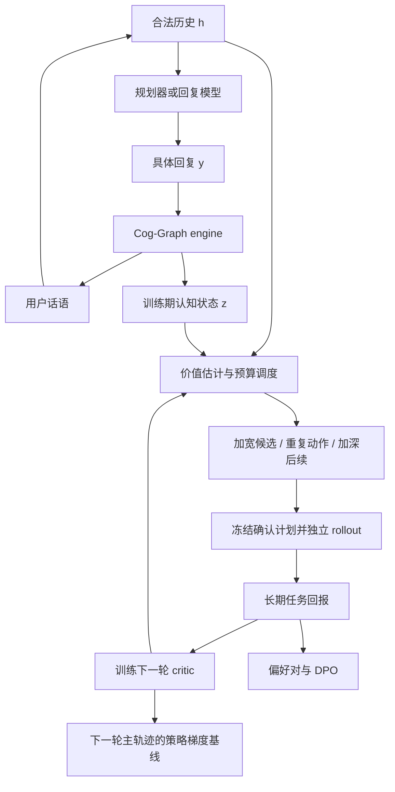

# CSRL：认知状态引导的强化学习——算法与实验设计

> Cognitive-State-Guided Reinforcement Learning（CSRL）  
> 日期：2026-09-06。本文依据当前仓库代码和 PPDPP 提出算法设计，明确区分已实现环境与拟新增训练模块。超参数为启动建议，尚未经过实验验证；本文不表示训练代码已经实现。

> 本次优化参考 [CSRL构想.md](CSRL构想.md)，吸收同状态对照、机制覆盖、噪声诊断和独立复核。核心新增“加宽／重复／加深”预算分配；沿用现有 schema 和任务奖励，不恢复旧版概率、重要性等字段。

## 1. 研究问题与实验组织

研究问题：**在相同训练成本下，显式用户认知状态能否改善采样预算分配和长期行为价值估计，从而提高对话策略的学习效率？**

认知状态作为训练期特权信息使用。部署时策略只读取合法公开历史及自身任务信息，不要求获取真实用户认知图。

| 路线 | 学习对象 | 优化方式 | 定位 |
|---|---|---|---|
| CSRL-Planner-RL | 根据对话历史选择策略的小模型 | 在策略采样的策略梯度＋认知价值基线 | 主实验：采样效率与信用分配 |
| CSRL-Planner-Pref | 同一策略规划器 | 离散策略的 DPO 式偏好优化 | 连接实验：控制动作空间与模型 |
| CSRL-Response-DPO | 直接生成回复的开放权重 LLM | 回复级 DPO | 泛化实验：不同学习粒度 |

三条路线共享环境接口、任务奖励、快照、预算调度与续采样服务，不必共享 Q 网络参数，因为动作空间和行为策略不同。DPO 是框架内的偏好学习路径，不称为在线策略梯度算法。初期不将 DPO 和 RL 串联训练，避免混淆贡献。

PPDPP 通过小型策略规划器控制冻结回复 LLM，并用模拟交互和目标回报训练规划器，原文使用普通策略梯度而非 PPO。[PPDPP 原论文](https://arxiv.org/html/2311.00262v2)

与 PPDPP 的区别应落在“认知信息如何改善经验采集和价值估计”。只把用户模拟器替换为本仓库 engine，不足以证明 CSRL 算法贡献。



## 2. 现有模拟器：输入、建模与输出

### 2.1 代码与能力边界

| 文件 | 已实现功能 |
|---|---|
| [schema.py](../engine/schema.py) | Seed、BDI 节点、边、Appraisal、Emotion 与工具契约 |
| [prompts.py](../engine/prompts.py) | 初始化、用户转移、条件重写、agent 输入隔离 |
| [updater.py](../engine/updater.py) | 图增量落地、噪声和承诺守卫 |
| [simulator.py](../engine/simulator.py) | init、step、恢复、审计、日志；当前 SCHEMA_VERSION=3 |
| [llm.py](../engine/llm.py) | 结构化调用、模型配置与重试 |
| [agent.py](../engine/agent.py) | 普通回复调用，目前没有可训练规划器 |
| [eval_tree.py](../tools/eval_tree.py) | 深复制模拟器、共享前缀、手写话术分支 |

尚未实现：RL wrapper、任务奖励、V/Q critic、认知调度器、训练轨迹格式、DPO 导出器、参数优化器及统一实验管理。部分 README 已落后于代码，实验必须锁定实际版本。

### 2.2 Seed 输入与信息可见性

| 字段 | 用途 | 可见性 |
|---|---|---|
| seed_id | 缓存、分组、去重 | 不作为模型捷径特征 |
| task | emotional_support / persuasion_donation / price_negotiation | 环境与策略 |
| persona | 对话前公开用户信息 | 环境与策略 |
| private_persona | 用户私有立场，如买方目标价 | 仅模拟器 |
| agent_private | agent 自身私有立场，如卖方底线 | agent 合法输入；当前谈判 renderer 使用 |
| scenario | 场景 | 合法任务上下文 |
| pre_context / u0 | 干预前缀；无前缀时用 u0 | 初始化和后续交互 |
| reference_transcript | 参考后续对话 | 禁止进入 Init、rollout、actor 或 critic 的在线输入 |
| cognitive_style | 第一人称认知更新习惯 | 仅模拟器提示词 |
| cognitive_profile | 守卫档位 | 仅引擎程序逻辑 |
| notes | 来源及任务元信息 | 白名单使用，禁止整段输入模型 |

预处理先固定干预前缀，再抽取 persona；不得从后续成交、捐赠等结果反推初始意向。公开／私有划分必须在数据构造阶段审查。

### 2.3 BDI 图 G

节点字段为 `id/type/content/strength`。B 表示信念命题，D 表示希望实现或避免的状态，I 表示具体行动承诺。content 采用用户第一人称，strength 是 `[0,4]` 直接浮点输出；不是概率分布、不确定性或熵。ID 只在会话内有效，不能将不同用户的 B1 当作同一特征。

| 关系 | 合法方向 | 机制 |
|---|---|---|
| facilitates / inhibits | B→D、D→I、B→I | 合意性评价、慎思、手段评估 |
| means_for | I→D | 意向的目的归属 |
| conflicts_with | D↔D | 欲望冲突，无向 |

引擎维护活跃与失活节点，支持节点 add/update/deactivate 和边 add/remove。非法方向被拒绝，但**不会沿边自动传播强度**；变化由 LLM 提议。因此图是结构化模拟状态与审计依据，不是真实心理因果识别的证明。

### 2.4 Appraisal 与 Emotion

定义 `z_t=(G_t,A_t,E_t)`，A 表示 Appraisal，RL 优势另用 Adv 表示。

| 状态 | 字段 |
|---|---|
| Appraisal | goal_congruence∈[-1,1]、controllability∈[0,1]、goal_conflict∈[0,1] |
| Emotion | category、valence∈[-1,1]、arousal∈[0,1]、appraisal_target |

category 为 17 类闭合集：neutral、anxiety、sadness、shame、guilt、anger、fear、loneliness、helplessness、confusion、frustration、irritation、distrust、relief、hope、warmth、surprise。appraisal_target 指向节点或话语目标。

当前初始化 A 为 `(0,0.5,0)`，E 为 neutral、valence=0、arousal=0.2、target=`#session_start`。这是实现约定，不代表用户初始真实情绪中性；困扰可能已在 persona/G0 中。需要检查该默认值对早期价值预测的影响。

### 2.5 初始化契约

\[
G_0=Init(P,S,H_0;style).
\]

输入：用户 persona（含用户私有信息）、style、场景、干预前缀；system 包含本体、初始化及任务规则。初始化依据固有态度、情境激活、前缀直接证据三层信息；无前缀证据时不预植成交／捐赠等结果意向。

`initialize_cognitive_state` 输出 nodes、edges；`build_initial_graph` 落地。`init()` 返回日志，包含 graph、strengths、deactivated、初始 A/E、llm_raw、ops_rejected、notes。

初始化使用 `ANTHROPIC_INIT_MODEL` 和 temperature=0，并缓存至 session 目录的 `g0/<seed_id>.json`。复用缓存保证同一实验起点，不能承诺外部 API 在 temperature=0 下完全确定。

拟新增缓存键：seed 内容、prompt、模型、schema 的哈希。当前按 seed_id 定位，修改种子后可能读到旧图。

### 2.6 单轮输入与执行顺序

```python
turn = sim.step(agent_reply=y_t)
```

engine 接受具体话语 y，不接受抽象策略 a；planner 必须先经过冻结回复模型生成 y。

实际 pipeline：

1. 输入 persona、style、当前图、上一轮 A/E、历史、最新 y 和上一轮拒绝／审计反馈。
2. `simulate_user_turn` 联合生成 node_updates、edge_updates、appraisal、emotion、user_utterance、done、done_reason。
3. updater 落地图操作；截断 A/E 范围，执行守卫及审计。
4. 实质性拒绝或警告触发 `rewrite_user_turn`，只重写用户话语及终局字段，不能再次修改图。
5. 提交状态与历史，记录 turn 并返回。

正常轮为一次联合结构化生成后程序落地，并非两个独立串行生成模型。重写提高状态话语一致性，但不构成语义一致性的数学保证。结构校验、API 重试、条件重写可能带来多次调用，`turn.retries` 不覆盖全部 API 尝试。

重要守卫：纯强度变化 `|Δ|<0.4` 的过滤（真实内容修订例外）、persistent 意向持久性、非法边拒绝。代码中反抗审计检查 `reactance == "pronounced"`。更新阻抗主要通过自然语言 style 实现，不能当作已实现的数值转移参数。

### 2.7 上下文与时域

模拟器读取完整前缀和最近 8 条新增话语；图提示显示活跃图及最近失活信息，并截断过长节点文本。agent renderer 使用前缀及完整新增历史。训练时记录双方截断规则。

已有 16 条新增历史话语后，提示词要求下一轮尽快结束，即 8 个完整交互之后出现收尾提示；它不是硬截断。建议训练版将此提示参数化并关闭，由 wrapper 统一 `T_max`。保留原配置作为兼容实验，环境配置改变后重新检查模拟质量，所有比较组一致。

### 2.8 输出消费

| turn 字段 | 用法 |
|---|---|
| agent_reply、user_utterance | 更新公开历史 |
| graph_after、deactivated_after | 下一图与恢复依据 |
| appraisal、emotion | 下一认知状态 |
| deltas、ops_applied | 实际状态变化特征 |
| ops_rejected、notes | 审计；不直接当作负奖励 |
| done、done_reason | 终止提示；不等于任务成功 |
| llm_raw、retry_raw | 调试，不进入训练模型输入 |
| turn_index、mode、system_prompt_used | 复现与追踪 |

新增、失活、内容改写与边变化无法只靠 deltas 完整描述，需结合前后图和 ops_applied。前动作 critic 输入禁止使用当前动作之后的 graph_after、终局结果或评价。

## 3. 形式化与模型接口

完整可分支状态：

\[
x_t=(Seed,G_t,A_t,E_t,history_t,feedback_t,terminal_t,config).
\]

h 是合法公开历史及 agent 自身信息，z 是结构化认知部分；不假定 z 是充分 Markov 状态。

\[
(x_{t+1},u_{t+1})\sim\mathcal E(\cdot\mid x_t,y_t),\qquad
J(\theta)=\mathbb E\sum_{t=0}^{T-1}\gamma^t r_t.
\]

| 模块 | 输入 | 输出 |
|---|---|---|
| planner actor | h | π(a∣h) |
| 冻结回复模型 | h、策略描述 a | y |
| 回复 actor | h | π(y∣h) |
| 认知 V | h、z | 期望回报及集成分歧 |
| 认知 Q | h、z、a 或 y | 动作价值及集成分歧 |
| 采样器 | 完整快照、预测、预算 | 分支任务与选择概率 |
| reward adapter | 对话、任务目标、合法评价元信息 | reward、结构化结果 |

主 critic 不额外读取 private_persona/style/profile；可另设完整特权信息消融。如此能区分认知图与人格元数据的贡献。私有信息不进入 actor，也不进入 DPO prompt。

认知编码起点：序列化节点 type/content/strength÷4/active、局部 ID 与边、A/E，接文本编码器和回归头。固定 token 上限，记录截断率。比较完整图、无边节点集合、A/E、等 token 心理摘要后，再决定是否引入 GNN。

建议 3 个独立初始化或案例级 bootstrap 的价值模型组成集成。标准差仅为经验不确定性指标，须与留出 rollout 误差校准；不等于统计置信区间。

## 4. 任务奖励与终止

主实验保持奖励不变，让认知状态改善估计，而非直接改变目标：

\[
r_t=\begin{cases}-c,&交互继续,\\R_{task}(\tau),&任务终局或达到时限.\end{cases}
\]

建议 γ=0.99、c=0.02，终局奖励归一化至 `[0,1]`，终局轮不重复扣 c。这是同条件 CSRL 配置，非 PPDPP 原始超参数。

| 任务 | 建议终局目标 | 额外评价 |
|---|---|---|
| 谈判，当前 agent 为 seller | 有效成交且满足卖方硬底线：0.5＋0.5×卖方归一化效用；否则 0 | 成交率、价格、包含未成交的期望效用、约束违反率 |
| 情感支持 | 独立 rubric：无改善／恶化 0、部分改善 0.5、显著改善 1 | 盲评支持效果、理解程度、质量 |
| 捐赠 | 对话中明确承诺捐赠为 1，否则 0 | 承诺率、明确金额、质量 |

谈判效用可取 `clip((price-seller_floor)/(listed_price-seller_floor),0,1)`；仅在元信息可靠且分母为正时使用，否则事先规定成交率目标并分开报告，禁止临时猜底价。对照需统一买卖角色。对话捐赠承诺不是实际支付，支持评分不是临床效果。

reward adapter 拟输出：

```json
{
  "terminated": false,
  "truncated": false,
  "outcome": "ongoing",
  "reward": -0.02,
  "task_score": null,
  "valid_transition": true,
  "termination_source": null,
  "evaluator_version": "task-rubric-v1"
}
```

- terminated：成功、拒绝、破裂等任务终止；truncated：达到统一上限。
- API/schema 失败有限重试后记为无效转移，不伪造用户拒绝或成功；费用仍计入，报告失败率及排除偏差。
- done 分支不再 step，不复制成多个独立叶子。
- engine done 但 evaluator 不认可成功时，记录非成功终局和冲突，不为提高分数继续对话。
- evaluator 固定 rubric、模型与解码设置，验证集校准后冻结。训练评估结果不依靠 BDI 自评。

认知奖励作为后续消融，可测试 `r'=r+λ[γΦ(x')-Φ(x)]`。只有满足固定势函数、终端边界等条件才能引用策略不变性结论；任意强度增量之和没有此保证。[势函数奖励塑形](https://people.eecs.berkeley.edu/~pabbeel/cs287-fa09/readings/NgHaradaRussell-shaping-ICML1999.pdf)

## 5. 统一树 rollout 与预算调度

### 5.1 快照、动作和环境随机性

原型使用 `copy.deepcopy(sim)`，分支 `session_file=None`，集中写训练记录。正式 wrapper 提供 reset/snapshot/restore/fork/step；恢复须保留完整图、失活节点、历史、反馈、seed 与配置。不能只存 G，也不能因 G 相似而合并不同历史。

树区分“候选动作”与“同一动作的随机结果”。planner 下先采样 a，再由冻结回复模型采样 y，再采样用户反应；策略价值需要平均不同措辞和用户反应。复制状态不代表固定了外部 API 随机种子。

每轮冻结行为策略 π_k，候选动作 b 后使用同一 π_k：

\[
Q^{\pi_k}(x,b)=\mathbb E[\sum_{j=0}^{T-t-1}\gamma^j r_{t+j}\mid x_t=x,b_t=b,随后用\pi_k].
\]

b 可以是策略 a 或回复 y。强制首动作得到 Q 标签，从首动作开始按 π_k 采样才得到 V 标签。回传使用期望回报而非最大叶子回报；后者对应不同搜索策略目标。

### 5.2 预算流程

建议 B 初始划分为 50% 主轨迹、30% 先导分支、20% 独立确认；包含回复生成、用户模拟、评价和重试，比例在验证集固定。

1. 从训练案例均匀采样主轨迹并保存每步完整快照。
2. 建立非终止父节点池，每案例设节点上限。
3. 选中父状态采样初始 K 个候选，记录来源与机制；主比较组候选规则相同。
4. 每候选先执行一次用户转移，读取实际落地状态，用冻结 critic 估计后续价值。
5. 先按父节点优先级选择位置，再按第 5.5 节选择加宽、重复或加深，保留均匀探索。浅层分数只用于调度。
6. 先导结束后固定确认父节点、候选及重复数。
7. 从原始父快照重新启动独立确认 rollout，生成最终价值和偏好标签。

独立确认用于减轻自适应停止和挑赢家的乐观偏差；它不消除隐藏状态选择带来的数据分布变化。低预算下减少确认对象，不能以一次幸运成功制造可靠标签。

### 5.3 调度公式起点

候选 i 的集成均值为 μ_i、标准差为 s_i。父节点 n：

\[
u_{ij}=\sqrt{s_i^2+s_j^2+\epsilon},\quad
S(n)=\frac{\max_{i<j}\{u_{ij}\exp(-|\mu_i-\mu_j|/(u_{ij}+\epsilon))\}}{\widehat C(n)+\epsilon}.
\]

\[
q(n)=\eta/|\mathcal N|+(1-\eta)softmax(S(n)/\tau_s).
\]

优先考虑排序不确定、可能被追加样本改变判断且成本可接受的位置。η 建议 0.2；critic 未训练时使用均匀 warm-up，费用计入。保存 q、候选池、分数、策略版本与预算。

这是假设性启发式，需与相同公式的 history-only critic、均匀扩展、仅按状态变化量扩展比较，不称为最优信息增益。观察动作后的状态变化也需要一次环境调用，必须计费。

### 5.4 机制覆盖候选与来源隔离

生成时指定“尝试什么”，评估后判断“是否有效”。禁止将“这是好／坏回复”输入 engine。以用户担心建议难以执行为例，可尝试情感确认、询问执行障碍、提供低成本步骤、重复一般建议；这些方向不预设奖励。

| 候选来源 | 生成信息 | 用途 | 训练边界 |
|---|---|---|---|
| 当前策略 | 合法 h；planner 的回复模型还读 a | 主比较，保留真实模型能力分布 | 只有原始在策略主轨迹进入主 actor loss |
| 公开机制 | h＋预定义策略描述 | 动作覆盖消融 | 强制机制回复不是原 π(y∣h) 的在策略输出 |
| 认知教师 | h＋z＋策略描述 | 特权教师扩展，单独实验 | 可构造偏好／具体回复 Q，不能冒充在策略动作 |
| 诊断探针 | 固定父状态，刻意构造 neutral、约束冲突等 | 环境敏感性评估 | 与主训练样本分开 |

主方案以当前策略候选为主。可由冻结、只看公开历史和候选话语的分类器标记机制；标记只做覆盖分析，不是有效性标签，费用计入。公开机制和认知教师分别做消融；主采样对照共享候选池或生成规则，不能同时换候选和调度再将收益全部归因于调度。

保存 `candidate_source/mechanism_id/generator_version/generation_context_visibility`。教师不得把未公开的用户底线或私人事实写进回复；即使遵守此规则，利用 z 选择机制仍是特权帮助，需要单列。

planner 可以枚举 a，但估计原 Q(a) 时，y 必须从原冻结 f(h,a) 生成。教师改写的 y 只作为该具体回复的 Q 样本，不能当作原 f 下策略 a 的无条件样本。

### 5.5 加宽、重复、加深：两层调度

第 5.3 节选择父状态 n；随后按规则选择操作。第一版不额外训练调度策略。

| 操作 | 执行 | 解决的问题 | 边界 |
|---|---|---|---|
| WIDEN：加宽 | 同父状态新增候选并执行首轮 | 动作／机制覆盖不足 | 不提供已有动作的新重复样本 |
| REPEAT：重复 | 从原始父快照重做已有动作 | 首轮结果或长期排序不稳定 | 不能固定一次幸运用户反应后仅续写 |
| DEEPEN：加深 | 从已有非终止前沿按 π_k 继续 | 延迟效果与短视野误差 | 不提供独立首轮用户反应 |

回复路线 REPEAT 固定 y；planner REPEAT 固定 a、重新生成 y 和用户反应。专门隔离用户噪声时可固定 y，但必须标明估计对象，不能混为策略方差。

调度量均使用当时已获得的信息：

- `coverage_gap`：预设可用机制的未覆盖比例；可用性只由 h 判断。
- `ranking_unresolved`：候选价值差相对集成分歧／先导波动仍小。
- `repeat_count`：从父快照独立执行首动作的次数；API 重试不算。
- `frontier_uncertainty`：未终止前沿的价值集成分歧，不是节点 strength。
- `state_signature`：实际新增／失活、内容变化、强度变化、边变化及 A/E 差异，描述响应模式，不当作收益。
- `cost_remaining`：全局及本节点预算、生成上限和重试预留。

规则起点，按顺序检查：

1. 覆盖不足且未达 K_max：WIDEN；同义去重失败也计生成费用。
2. 排序未定且尚未达到最小重复数：REPEAT；样本少时不声称已分解模型误差与环境噪声。
3. 完成最小重复，仍有影响排序的前沿不确定性且未达深度上限：DEEPEN；比较双方轮流扩展，不能只延长当前赢家。
4. 已有完整先导回报仍波动较大：REPEAT 影响排序的动作；排序稳定或充分采样后近似平局时停止该节点。
5. 信息不足无法判断时按固定随机操作配额探索；上限耗尽后标为 unresolved，不强制生成偏好。

建议 K_initial=4、K_max=6；初始深度 1 个完整交互，每候选最小独立重复数 2；每次加深 1 轮，先导深度上限 3。先导上限不限制独立确认跑到任务终止／T_max。任何配置受总成本上限约束。

认知版与 history-only 版使用相同规则、配额和超参数，只替换允许的状态特征和价值输入。阈值在独立验证分支点上设定；规则未经过验证，不声称最优。

### 5.6 浅层估值、停止与费用保护

先导长度 d 的估值可以使用：

\[
\widetilde Q_d=\sum_{j=0}^{d-1}\gamma^j r_{t+j}+\gamma^d V_k(h_{t+d},z_{t+d}).
\]

真实终止或有限时域 T_max 结束时 bootstrap 为 0，使用任务终局奖励。此估值仅供调度；主 critic 标签和 DPO 排序仍使用独立完整确认回报。直接用浅层分数训练属于单独 bootstrap 消融。

单轮 ΔG=0、负向情绪上升、小幅变化、独立复核无法验证，都不是单独剪枝依据；可能对应倾听、澄清或延迟收益。停止原因必须记录为：排序稳定、确认近似平局、预算耗尽、候选上限、深度上限、终局或环境错误。低信息不是失败，不人为赋负奖励。

开始独立确认前，按剩余 T_max、输出上限、评价和重试上限预留费用；不能保证完成时减少确认对象。费用截断的轨迹标记 `budget_censored`，不是任务时域结束，不进入主完整回报偏好。实际费用低于预留时回收余额。

### 5.7 独立复核与质量门

参考原构想的独立复核，按任务、阶段和变化量分层抽样，起点为 10% 转移，费用计入。模型与人工 rubric 待接入，不假定仓库已配置独立 CogWM。

| 复核结论 | 含义 | 主版本处理 |
|---|---|---|
| 支持 | 话语支持对应状态或变化 | 记录，不额外奖励 |
| 明确矛盾 | 例如图明确接受，话语明确拒绝 | 独立复查和质量报告 |
| 无法验证 | 用户未表达某个内部信念 | 保留，不自动降权 |

主版本用作诊断；若剔除确认矛盾样本，设置独立过滤消融并报告各组剔除率和费用。话语支持不等于心理真实，不要求用户逐项口述内部图。

环境先导保留原构想中的同义改写、neutral、约束冲突和不同 persona 对照。好坏方向由独立证据／人工审核建立，不由候选名称决定。用重复反应估计波动，不预设“零 schema 失败”或固定 sign-rate 已达标；采用区间与错误案例报告。

## 6. CSRL-Planner-RL 完整算法

### 6.1 策略表与初始化

planner 采用文本编码器＋分类头，先在合法训练集策略标注上 SFT；冻结回复 LLM 根据 h 和策略描述生成 y。

谈判可采用 PPDPP 的 11 类起点：Greetings、Ask a question、Answer a question、Propose the first price、Propose a counter price、Use comparatives、Confirm information、Affirm confirmation、Deny confirmation、Agree with the proposal、Disagree with a proposal。按当前卖方角色适配描述，数值报价由回复模型生成。

情感支持采用 ESConv 原始 8 类映射：Question、Self-disclosure、Affirmation and Reassurance、Providing Suggestions、Reflection of feelings、Information、Restatement or Paraphrasing、Others；接入时核验原始标签字符串。捐赠没有可靠策略标签时，先做 Response-DPO 扩展，再固定 planner 标签协议。

合法动作 mask 只能根据公开历史和 agent 自身约束构造，训练、采样和部署一致，不得利用私有图替 actor 排除动作。

### 6.2 主轨迹更新 actor，分支训练 critic

第一版采用统计上清楚的保守设计：分支不直接进入 actor loss，而是补充 V/Q 监督。

\[
G_t=\sum_{j=t}^{T-1}\gamma^{j-t}r_j,\quad
Adv_t=G_t-stopgrad(V_{\phi_k}(h_t,z_t)).
\]

\[
\mathcal L_{actor}=-\frac1N\sum_{i=1}^N\sum_t\gamma^t
\log\pi_\theta(a_{it}\mid h_{it})Adv_{it}.
\]

对应第 3 节折扣目标，按案例平均轨迹和。每个 on-policy batch 起点为一次更新；多 epoch PPO 是后续共同优化器消融，不能只给 CSRL 更换。

本轮 actor 使用采样前已冻结的 critic，防止 critic 拟合当前动作回报后使基线间接依赖该动作。也可按原始轨迹交叉拟合。训练期隐藏状态 baseline 与部分可观测策略有关，但不能声称任何认知 critic 都降低方差。[非对称强化学习](https://arxiv.org/abs/2105.11674)

分支确认用于：

\[
\mathcal L_V=E[(V(h,z)-G)^2],\quad
\mathcal L_Q=E[(Q(h,z,b)-G)^2].
\]

V 用从首动作起按 π_k 续采样的标签；Q 用固定首动作标签。planner 枚举所有合法策略时，可构造 `V_target=Σ_a π_k(a|h) Q_hat(x,a)`；未覆盖动作不能删掉再归一化。标签保存 policy_version，限制陈旧回报使用。

训练 buffer 混合主轨迹与分支，限制每案例权重；在独立主轨迹上验证 critic，避免只在优先区域准确。完整续采样为主版本，短视野＋bootstrap 单独作为成本偏差消融。

### 6.3 伪代码

```text
输入：训练 Seed、SFT planner、冻结回复模型、engine、reward adapter、预算
均匀 warm-up：初始化 V/Q，记录费用
for iteration k:
    冻结 π_k、V_k/Q_k、环境、评价器及解码配置
    D_main = 从均匀训练案例按 π_k 采样完整主轨迹，保存快照
    candidates = 从固定来源生成候选，记录机制及可见性，逐个浅层试探
    while 先导预算允许:
        n = 按 q 选父状态
        op = 按覆盖、重复数、排序与前沿信息选 WIDEN/REPEAT/DEEPEN
        执行 op，更新快照、先导统计与费用；检查停止条件
    selected = 在预留确认费用内固定对象、候选及重复数
    D_confirm = 从父快照独立确认，后续使用 π_k
    用 D_main 的 G - V_k 更新 actor 一次
    用主轨迹和确认数据训练下一版 V/Q，区分条件标签
    记录验证表现、critic 误差、累计费用
输出：只依赖合法 h 的 planner，部署不加载 engine 或 critic
```

该版本分支收益主要经 critic 体现，必须由等成本实验检验是否划算。后续若把树 Q 直接用于 actor 更新，需重新处理父状态选择、动作概率、共享前缀及自适应停止偏差；PPO 概率比不会自动校正全部搜索偏差。

## 7. CSRL-Response-DPO 完整算法

### 7.1 长期偏好构造

1. 同一 SFT 回复模型初始化 π_0，并固定 π_ref。
2. 冻结 π_k，按其采样主轨迹。
3. 同一 x、同一 h 下采样 K 个候选回复 y。
4. 先浅层试探，再按统一规则加宽／重复／加深；冻结候选集合后预留确认费用。
5. 独立确认候选长期回报，候选之后均使用 π_k。
6. 将排序可靠的候选构造成 `(h,y+,y-)`。
7. 标准 DPO 更新；下一轮刷新行为策略及数据。

每次确认从父快照重新执行 y，重新采样首个用户反应，而非重复使用一次幸运反应的后续。起点 K_initial=4、K_max=6，首轮浅层试探每候选 1 次，排序未定时追加至至少 2 次独立执行；确认每候选 4 次。先导后预先固定确认样本数。

保留条件建议平均回报差 ΔQ≥0.05 且 bootstrap 排序稳定率≥0.8，验证集调节并冻结。这是经验过滤，不是小样本显著性保证。每父节点最多 2 对，保留平局／不确定统计；每案例设配额。

### 7.2 优化目标与输入隔离

\[
\mathcal L_{DPO}=-E\log\sigma\left(\beta\left[
\log\frac{\pi_\theta(y^+|h)}{\pi_{ref}(y^+|h)}-
\log\frac{\pi_\theta(y^-|h)}{\pi_{ref}(y^-|h)}\right]\right).
\]

仅计算当前 assistant 回复 token 的序列 log probability，mask 掉 prompt；后续双方轨迹用于标签，不拼成 completion。第一版不额外按认知变化量加训练权重，不悄悄改成长度平均损失。[DPO 原论文](https://arxiv.org/abs/2305.18290)

隐藏状态影响样本选择，可能过度代表某类用户；即使 actor 看不到 z，也存在覆盖偏差。采用均匀探索、案例配额和风格分层评价。同一 h 在不同隐藏用户状态下有不同偏好属于部分可观测性，不应靠删矛盾数据掩盖。

拟新增导出格式：

```json
{
  "case_id": "train_case_001",
  "parent_id": "tree_001_node_003",
  "prompt_messages": [{"role": "user", "content": "public context only"}],
  "chosen": "assistant reply A",
  "rejected": "assistant reply B",
  "metadata": {
    "policy_version": "iteration_2",
    "reference_version": "sft_v1",
    "q_chosen": 0.7,
    "q_rejected": 0.3,
    "confirmation_runs_per_action": 4,
    "parent_selection_probability": 0.02,
    "candidate_source": "current_policy",
    "mechanism_id": "clarification",
    "schedule_log_id": "schedule_001",
    "budget_censored": false,
    "snapshot_id": "private_snapshot_123",
    "evaluator_version": "task-rubric-v1"
  }
}
```

数值仅为示例。metadata 不输入模型，私有快照独立存储；loader 明确白名单。

## 8. 连接实验：Planner-Pref

保持 Planner-RL 的骨干、SFT 权重、策略表、冻结回复模型、数据和奖励，将 DPO 损失的回复 y 替换为策略 a。每条策略重复生成具体回复和用户反应后评估长期价值。

与 Planner-RL 比较控制了动作空间与模型；与 Response-DPO 比较共享偏好学习机制。无需三条路线同等规模，但应比较各自相对匹配基线的增益，不把不同模型的绝对分数当成唯一证据。

## 9. 实验设置

### 9.1 数据划分与规模

本次核查 `seeds/` 有 16 个 JSON：谈判 5、情感支持 6、捐赠 5，仅适合流程先导，不足以正式训练和测试。

正式实验优先 ESConv、CraigslistBargain，捐赠第三阶段扩展。沿用有依据的公开划分；采用 PPDPP 派生划分时记录案例清单和版本，不凭相同比例宣称复现。

- 同一原始对话／用户／商品案例及其 persona/style 变体归入同一 split。
- SFT、critic、偏好、采样器只用训练集；超参数用验证集；测试冻结。
- 禁止参考后续对话进入初始化；notes 逐字段筛选。
- 当前人工挑选种子不能作为调参后的独立测试。
- 合成风格改写单独标识，不当作真实人口分布。
- 先导建议每任务训练 100、验证 30 个案例；正式采用可用合法划分并锁定实际数量。测试尽量至少 100 个独立案例，样本不足时报告不确定性。

### 9.2 公共配置起点

| 参数 | 建议设置 | 约束 |
|---|---|---|
| planner | RoBERTa-base 级编码器＋分类头 | 全部 planner 组同初始权重 |
| 回复 actor | 可训练 7B–8B 级 instruct 模型＋LoRA | 资源评估后固定具体 checkpoint |
| planner 回复模型 | 同一冻结模型 | 统一策略 prompt 和解码 |
| 环境／Init | 固定实际 ANTHROPIC_MODEL / ANTHROPIC_INIT_MODEL | 与 actor 分离配置，记录实际解析 ID |
| critic | 轻量编码器，3 个价值模型 | 对照容量、训练步数匹配 |
| T_max | 10 个新增完整交互 | 统一或关闭现有收尾提示 |
| γ、c | 0.99、0.02 | 全部同条件训练组一致 |
| 回复候选 | K_initial=4，K_max=6，temperature=0.8，top-p=0.95 | 来源固定；机制来源另作消融 |
| 先导调度 | 初深度 1、最小重复 2、每次加深 1、深度上限 3 | 上限不是终局；确认跑完整剩余时域 |
| 费用预留 | 主轨迹／先导／确认 50%／30%／20% | 预留不足时减少对象，不伪造完整回报 |
| 用户转移 | 支持时显式 temperature=0.7 | 当前未显式设置；参数化后检验环境质量 |
| 回复长度 | 最大 256 新 token | 全部回复组一致 |
| planner／critic LR | 1e-5／2e-5 | 同验证搜索空间 |
| LoRA／DPO | rank=16、LR=5e-6、β=0.1 | 起点，固定参考模型 |
| DPO 更新 | 每轮新数据 1 epoch 起步 | 另计训练 token 预算 |
| 主 batch | 16 条完整主轨迹 | 叶子不当独立案例 |
| 随机种子 | 至少 3，主结论建议 5 次训练 | 外部 API 随机性独立说明 |

运行前还须固定具体 checkpoint、策略映射、软件版本、数据 manifest、总预算和验证调参次数。以上参数不代表当前硬件可运行或已得到最优设置。

### 9.3 Planner-RL 主实验组

| 组 | 环境 | 采样 | 学习信号 | 目的 |
|---|---|---|---|---|
| P0 | 普通 LLM 用户模拟器 | 链 | PPDPP 式回报 PG | 外部方法基线 |
| P1 | engine | 链 | 同 P0 | 环境替换收益 |
| P2 | engine | 链 | history-only critic | critic 本身收益 |
| P3 | engine | 链 | h＋z critic | 无树认知增益 |
| P4 | engine | 均匀树 | history-only critic | 普通树基线 |
| P5 | engine | 均匀树 | h＋z critic | 认知估计收益 |
| P6 | engine | history-only 自适应树 | history-only critic | 一般自适应收益 |
| P7 | engine | 认知自适应树 | history-only actor baseline | 单独认知采样收益 |
| P8 | engine | 认知自适应树 | h＋z critic | 完整 CSRL |

P7 的调度 Q 仍可看 z，只有 actor baseline V 不看 z。P4/P5/P7/P8 构成采样×信用分配核心消融，P6 排除一般自适应的解释。actor 优化算法统一，不只给 CSRL 更强优化器。

### 9.4 偏好实验组

| 组 | 数据构造 | 目的 |
|---|---|---|
| D0 | SFT，不做偏好优化 | 起点 |
| D1 | 同前缀候选，独立单轮 judge 排序 | 常规偏好基线 |
| D2 | 独立链续采样，以长期回报排序 | 长期监督基线 |
| D3 | 均匀共享前缀树＋确认回报 | 普通树收益 |
| D4 | history-only 自适应树＋确认回报 | 一般自适应收益 |
| D5 | 认知自适应树＋确认回报 | 完整 Response-DPO |

固定初始模型、参考模型、训练器和候选配置。分别报告固定总采集成本、固定训练偏好对数量的结果：前者测效率，后者测标签质量，不能混称等预算。Planner-Pref 至少做 D3/D4/D5 对应的策略版本。

### 9.5 认知与机制消融

1. h；h＋A/E；h＋无边 BDI；h＋完整 G/A/E。
2. 等证据、近似等 token 的心理摘要；生成成本计入。
3. 删除边、打乱强度、延迟 z 一轮：只改训练模块输入，不改模拟器转移。
4. 若另做模拟器去图，明确区别于训练器看不到图。
5. 均匀扩展、仅价值不确定性、仅状态变化量、仅父节点优先级、完整三操作调度；分别禁用 WIDEN/REPEAT/DEEPEN，并给出剩余预算如何重分配。
6. 无独立确认／有确认；完整续采样／短视野 bootstrap。
7. 固定候选下比较调度；固定调度下比较当前策略／公开机制／认知教师，分离候选与调度贡献。
8. 独立复核只诊断／过滤明确矛盾；报告无法验证比例与过滤偏差。
9. 主结论建立后再测试认知势函数奖励。

先做固定数据价值预测：独立高重复 rollout 提供参考回报，报告 MAE/RMSE、动作排序准确率、不确定性校准和单位费用误差。如果 z 不提供增量预测信息，应先检查状态和编码，不能仅靠增加复杂搜索声称有效。

### 9.5.1 训练前的预算调度先导实验

每任务选择 30–50 个独立分支点，覆盖早／中／晚阶段、neutral、目标冲突与不同认知风格；每点固定 5–6 个候选。调度阈值验证点与最终机制测试点按原始案例隔离。这是小样本先导，不替代正式训练和泛化测试。

先比较固定候选子集（仅重复／加深），保证评价目标一致；再用完整固定候选池、相同初始 4 个候选比较带加宽的调度。在线生成新候选放到独立候选来源实验，不能改变固定池参考排序。

在相同冻结后续策略下，为每个候选另收集例如 20 次完整参考 rollout，报告参考均值区间；接近候选承认排序不确定，不将参考均值称为真值。参考数据不进入调度器、critic 或训练标签，其费用作为单独评价开销报告，不能让某组免费读取。训练数据来源独立。

| 调度组 | 节点／操作选择 | 验证问题 |
|---|---|---|
| S0 | 均匀节点＋固定操作配额 | 基本预算基线 |
| S1 | 即时认知变化大小＋固定配额 | 变化幅度是否足够 |
| S2 | history-only 价值＋同三操作规则 | 一般价值调度收益 |
| S3 | 认知价值选父节点＋固定配额 | 仅节点选择收益 |
| S4 | 认知价值＋加宽／重复／加深规则 | 完整 CSRL 调度 |

比较相同累计费用下的动作排序准确率、价值 RMSE、推荐动作相对参考最优的 simple regret、偏好误标率及可靠对数。排序指标对参考近似平局单独统计；simple regret 也报告参考估计不确定性。另报告三操作次数／费用比例、覆盖率、平均深度、重复数和各停止原因。

通过标准：在多个费用档位上，相对 S0 和 S2 有可重复增益，且不限于人为明显好坏探针；预先规定主要指标和验证阈值。未通过时先诊断认知表示、校准和规则，不把增加完整 RL 训练作为跳过机制验证的办法。

### 9.6 指标、成本与统计

**任务表现：** 成功率、终局任务分、谈判期望效用、成功率随轮次曲线。平均轮数分别报告全部案例和成功案例，防止快速失败显得高效。

**采样效率：** 固定累计费用下的任务表现、学习曲线面积、达到预设目标的成本；未达到报告未达到，不外推。

**完整成本：** G0、主轨迹、候选、确认、回复生成、用户模拟、重写、校验/API 重试、评价器、摘要的输入／输出／缓存 token 与调用次数；另报 GPU 训练时长、训练 token、墙钟时间。不同模型 token 不视为等价价格，按冻结计价表另报费用。

**学习机制：** critic 留出误差、排序稳定性、每千 token 的可靠偏好对、长度与胜率分布、同策略独立数据上的梯度方差诊断。

**环境质量：** schema 失败、拒绝、重写、终止冲突、非法成交、状态话语不一致。审计通过不能替代独立人工检查。

**统计：** 原始案例级聚类 bootstrap，跨训练种子均值和区间。共享前缀叶子、同案例变体和重复用户响应不是独立用户。验证调参次数公平，测试只在预设检查点运行。

### 9.7 独立泛化

至少评价同 engine 未见案例、不同模型／提示词的用户模拟器和独立盲评；条件允许补充人工交互。judge 不读训练图，仅看合法任务信息和实际对话。

对未见风格、高阻抗、目标冲突用户分层报告。若提升只在训练 engine 内成立，结论限定为模拟环境内效率，不宣称真实用户收益。

## 10. 实施与训练前修复

### 10.1 当前代码风险

| 问题 | 代码依据 | 待处理 |
|---|---|---|
| 调用失败可能被算成交 | eval_tree 异常设置 done；classify_outcome 对非特定拒绝文本默认 deal | 用结构化 outcome 区分错误与任务结果 |
| 重写后 done_reason 可能旧值 | simulator 在重写前存局部 reason，最终 turn 仍引用它 | 写最终 out.done_reason 并检查一致性 |
| 守卫用重写前 done | apply_updates 先执行，重写可能翻转 done | 定义终局修正语义并检查翻转场景 |
| 阈值文案不一致 | updater=0.4，SYSTEM_CORE 部分写 0.5 | 统一并记录版本 |
| 缓存缺版本 | G0 按 seed_id 读取 | 增加输入／prompt／模型哈希 |
| step 无硬终止拒绝 | 调用者可继续已结束会话 | wrapper 阻止，测试 |
| 上下文收尾影响时域 | 16 条历史后要求结束 | 参数化，与 T_max 统一 |
| 成本信息不足 | wrapper 返回工具内容，未保留完整 usage | 保存所有调用和尝试 |
| actor/环境模型耦合 | generate_text 与 generate_turn 共用 MODEL | 拆配置，接可训练 actor |
| 树调用数注释过期 | 当前二叉 4 层最多 30 次 step，注释约 15 次 | 实测计数，重试另计 |

本文只写设计，不修改这些代码。环境修复后需固定新版本，并在该版本上重新构造或核验训练缓存。

### 10.2 拟新增模块

```text
training/csrl/
  env_adapter.py       # reset/fork/step、合法输入、终止
  rewards.py           # 任务结果与评价协议
  policies.py          # planner、回复 actor、策略 renderer
  state_encoder.py     # h/z 编码与隔离
  value_models.py      # V/Q 集成与版本
  rollout.py           # 主轨迹、条件续采样、确认
  scheduler.py         # 节点 q、三操作规则、停止与费用预留
  candidate_bank.py    # 来源、机制覆盖、探针与教师隔离
  audit_sampling.py    # 分层独立复核与三类结论
  preferences.py       # 配对、去重、白名单导出
  train_planner.py     # RL 与策略偏好优化
  train_response.py    # 回复 DPO
  evaluate.py          # 独立环境与案例统计
  configs/             # 模型、数据 manifest、预算、实验组
```

路径为规划，尚不存在。统一记录至少包含 case/split、tree/parent/node、前动作快照、合法 h、动作类型和文本、行为概率、策略版本、调度 q、后续策略版本、实际回复、reward/outcome、原始 turn 引用、成本、失败状态。共享边存一次，路径引用边；loss 明确案例和父节点权重。另存每次调度的 parent_selection_probability、operation、操作选择规则／随机概率、repeat_id、depth、candidate_source、stop_reason、budget_censored、audit_verdict。确定性操作规则记录规则版本，不能将父节点 q 当作完整轨迹采样概率。

### 10.3 实施顺序与验收

1. 修复终局／失败／缓存／费用，建立快照与 wrapper；用现有种子做流程验证。
2. 扩展并划分数据，先验证状态预测，再运行第 9.5.1 节固定池预算调度实验；通过后进入训练。
3. Planner-RL 先 P1/P2/P3，再核心 2×2 与 P6，按等成本收益决定分支是否值得。
4. 同 planner 做偏好连接实验，控制动作空间。
5. Response-DPO 做 D0–D5，验证回复级适用性。
6. 多随机种子、独立环境、盲评、风格分层，冻结最终结果。

必要验证：加宽不重复候选、重复从父快照重启、加深不算独立首轮样本、费用截断不算终局、浅层估值不混入完整确认标签、三类复核不误删未表达状态；快照往返提示词一致、分支隔离、actor 无私有泄漏、DPO 只训练 assistant token、V/Q 标签条件正确、无未来信息 baseline、失败不成正样本、费用覆盖重试。实现后再运行这些检查；本次文档任务不启动训练。

## 11. 论文结论的证据要求

强支撑来自：认知信息有独立预测增益；等成本优于普通树和 history-only 自适应；采样与价值贡献可拆解；匹配对照中的 RL 和偏好学习均获益；收益在独立环境中保留。

若只看到 engine 内涨分，不能称真实用户效果；若只有树收益，没有认知相对 history-only 的收益，不能归因为 Cognitive-State-Guided。结构化心理状态是模拟器维护的估计，不是心理真值或因果识别结论。

## 12. 参考资料

- [PPDPP](https://arxiv.org/html/2311.00262v2)：规划器与冻结回复模型基线。
- [DPO](https://arxiv.org/abs/2305.18290)：偏好优化损失。
- [Unbiased Asymmetric RL](https://arxiv.org/abs/2105.11674)：特权信息与部分可观测价值估计。
- [Tree Search for LLM Agent Reinforcement Learning](https://arxiv.org/abs/2509.21240)：共享前缀与树结构学习信号相关工作；CSRL 需额外证明认知增益。
- [Policy Invariance under Reward Transformations](https://people.eecs.berkeley.edu/~pabbeel/cs287-fa09/readings/NgHaradaRussell-shaping-ICML1999.pdf)：可选塑形的条件。
- [仓库建模文档](insight.md)：BDI-E 动机；具体实验行为以锁定代码版本为准。
